# CampusBrew — Software Architecture & System Design Documentation

> Reverse-engineered from the actual codebase at commit `a2cc129` (branch `main`).
> Two repositories: `campusbrew-api/` (Spring Boot 3.5 / Java 17 / MongoDB Atlas) and `CampusBrew/` (Expo SDK 54 / React Native 0.81.5 / TypeScript).

---

## 1. System Overview

CampusBrew is a campus-scoped beverage delivery platform serving Cebu Institute of Technology – University (CIT-U). It coordinates three first-class actor roles through a single mobile client and a single REST + WebSocket backend:

- **Customer** — browses verified campus shops, places customizable beverage orders, tracks live order status, pays via GCash or Cash-on-Delivery.
- **Shop Operator** — manages a single owned shop, its menu, item availability, and the order acceptance/preparation/ready pipeline.
- **Delivery Personnel (Dasher)** — sets weekly availability schedule, receives realtime push offers for ready orders, claims/picks-up/delivers, accrues per-delivery incentives.

The system is built around a **hybrid push + pull delivery marketplace**: when a shop marks an order `READY_FOR_PICKUP`, the assignment engine broadcasts `delivery:request` to **every** active+idle dasher; the first to call the atomic claim endpoint wins (MongoDB `findAndModify`), losing dashers receive `delivery:claimed` and dismiss their offer modal. Unclaimed orders are cancelled by a scheduled job after a 10-minute timeout.

Authentication is JWT-only (stateless). The realtime channel runs on Netty-SocketIO on port `9092`, with the JWT validated by an `AuthorizationListener` at handshake time. Geospatial proximity (for future filtering) uses a 2dsphere index on `DeliveryPersonnel.currentLocation`. School-domain (`@cit.edu`) OTP gates account creation; a TTL index on `Otp.expiresAt` purges expired codes automatically.

---

## 2. Tech Stack

| Layer             | Technology                                   | Version                       | Source                   |
| ----------------- | -------------------------------------------- | ----------------------------- | ------------------------ |
| Backend runtime   | Java                                         | 17                            | `pom.xml`                |
| Backend framework | Spring Boot                                  | 3.5.x                         | `pom.xml`                |
| Persistence       | Spring Data MongoDB                          | 3.5 (managed)                 | `pom.xml`                |
| Database          | MongoDB Atlas                                | (cloud)                       | `application.properties` |
| Auth tokens       | `io.jsonwebtoken:jjwt`                       | 0.12.6                        | `pom.xml`                |
| WebSocket server  | `com.corundumstudio.socketio:netty-socketio` | 2.0.9                         | `pom.xml`                |
| Email             | Spring Boot Starter Mail (SMTP)              | 3.5                           | `pom.xml`                |
| Lombok            | Project Lombok                               | latest                        | `pom.xml`                |
| Build             | Maven                                        | 3.x                           | `mvnw`, `pom.xml`        |
| Frontend runtime  | React Native                                 | 0.81.5                        | `package.json`           |
| Frontend platform | Expo SDK                                     | 54                            | `package.json`           |
| UI language       | TypeScript                                   | 5.x                           | `tsconfig.json`          |
| Navigation        | React Navigation                             | v7 (native/stack/bottom-tabs) | `package.json`           |
| Realtime client   | `socket.io-client`                           | 4.x                           | `package.json`           |
| Secure storage    | `expo-secure-store`                          | SDK54                         | `package.json`           |
| Geolocation       | `expo-location`                              | SDK54                         | `package.json`           |
| Icons             | `@expo/vector-icons` (Ionicons)              | SDK54                         | `package.json`           |

---

## 3. System Architecture (Logical View)

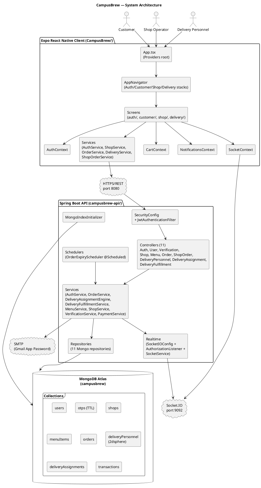

---

## 4. Architectural Patterns Used

| Pattern                                         | Where it appears                                                                                                                                                                                                    | Justification                                                                         |
| ----------------------------------------------- | ------------------------------------------------------------------------------------------------------------------------------------------------------------------------------------------------------------------- | ------------------------------------------------------------------------------------- |
| **Layered (Controller → Service → Repository)** | Every backend feature (`controller/`, `service/`, `repository/`)                                                                                                                                                    | Clear separation of HTTP concerns, business logic, and persistence; idiomatic Spring. |
| **Stateless REST + JWT**                        | `SecurityConfig`, `JwtAuthenticationFilter`, `JwtService`                                                                                                                                                           | Allows horizontal scaling; no server-side session state.                              |
| **Domain-Driven slicing by aggregate**          | `Order`, `Shop`, `MenuItem`, `DeliveryPersonnel`, `DeliveryAssignment`, `Transaction` collections                                                                                                                   | Each aggregate has its own repository, service, and DTOs.                             |
| **DTO / Mapper**                                | `dto/*DTO.java` (e.g. `OrderDTO`, `ShopDTO`, `MenuItemDTO`, `DeliveryPersonnelDTO`)                                                                                                                                 | Decouple wire format from persistence model; protects against over-posting.           |
| **Repository pattern**                          | `extends MongoRepository<T, String>` across 11 repositories                                                                                                                                                         | Spring Data derives queries from method names.                                        |
| **Atomic Compare-and-Swap (CAS)**               | `DeliveryAssignmentEngine.claimOrder` using `MongoTemplate.findAndModify` with `orderStatus == READY_FOR_PICKUP && deliveryPersonnelId == null`                                                                     | First-writer-wins claim semantics in a broadcast marketplace.                         |
| **Event Broadcast (Pub/Sub)**                   | `SocketService.emitToUser` / `emitToOrder`; events `order:statusUpdate`, `order:assigned`, `order:delivered`, `delivery:request`, `delivery:claimed`, `delivery:offer-expired`                                      | Real-time fan-out to interested clients.                                              |
| **Scheduled Job (Cron-like)**                   | `OrderExpiryScheduler @Scheduled(fixedRate=60000)`                                                                                                                                                                  | Auto-cancel unclaimed `READY_FOR_PICKUP` orders past TTL.                             |
| **TTL Index**                                   | `Otp.expiresAt @Indexed(expireAfter="0s")`                                                                                                                                                                          | MongoDB purges expired OTPs without app code.                                         |
| **Self-Heal Provisioning**                      | `AuthService` creates `Shop` on `SHOP_OPERATOR` signup and `DeliveryPersonnel` on `DELIVERY_PERSONNEL` signup; `ShopService.getMyShop` / `DeliveryPersonnelService.getMyProfile` re-create the row if it was missed | Avoids partial-state accounts.                                                        |
| **Context Provider (Frontend DI)**              | `AuthProvider`, `SocketProvider`, `CartProvider`, `NotificationsProvider` nested at `App.tsx`                                                                                                                       | Cross-cutting state for any screen via `useAuth`, `useSocket`, etc.                   |
| **Optimistic UI + Reconcile**                   | Customer order tracking patches local state on `order:statusUpdate`, then refetches                                                                                                                                 | Snappy UX without losing source of truth.                                             |
| **Belt-and-Suspenders polling**                 | `ShopDashboardScreen.useFocusEffect` runs `setInterval(load, 10_000)` _in addition to_ socket listeners                                                                                                             | Guards against missed events on reconnect blips.                                      |
| **Role-based navigation**                       | `AppNavigator.tsx` swaps `CustomerStack` / `ShopStack` / `DeliveryStack` based on `user.role`                                                                                                                       | Single binary, three apps.                                                            |

---

## 5. System Components Table

| #   | Component                                                                                          | Type              | Responsibility                                                                                                                                                           |
| --- | -------------------------------------------------------------------------------------------------- | ----------------- | ------------------------------------------------------------------------------------------------------------------------------------------------------------------------ |
| 1   | `CampusbrewApiApplication`                                                                         | Bootstrap         | Spring Boot entry; `@EnableScheduling`.                                                                                                                                  |
| 2   | `SecurityConfig`                                                                                   | Config            | Stateless filter chain; permit list for `/api/auth/**`, `/api/verification/**`, `/api/users/**`, `/api/shops/**`, `/api/orders/**`, `/api/menus/**`, `/api/delivery/**`. |
| 3   | `JwtAuthenticationFilter`                                                                          | Filter            | Parses `Authorization: Bearer …`, populates `SecurityContext`.                                                                                                           |
| 4   | `SocketIOConfig` + `AuthorizationListener`                                                         | Config            | Boots netty-socketio on 9092; validates JWT from query param at handshake; returns `AuthorizationResult.SUCCESSFUL_AUTHORIZATION` / `FAILED_AUTHORIZATION`.              |
| 5   | `SocketIOLifecycle`                                                                                | Lifecycle         | `@PostConstruct start()` / `@PreDestroy stop()`.                                                                                                                         |
| 6   | `SocketService`                                                                                    | Service           | `emitToUser(userId, event, payload)`, `emitToOrder(orderId, event, payload)`.                                                                                            |
| 7   | `MongoIndexInitializer`                                                                            | Bootstrap         | Creates `2dsphere` index on `deliveryPersonnel.currentLocation` on `ApplicationReadyEvent`.                                                                              |
| 8   | `AuthController` / `AuthService`                                                                   | Web + Service     | Register, OTP verify, login, resend OTP, forgot/reset password; auto-provisions `Shop` or `DeliveryPersonnel`.                                                           |
| 9   | `VerificationController` / `VerificationService`                                                   | Web + Service     | Sends OTP to `@cit.edu`; validates Student-ID regex `^\d{2}-\d{4}-\d{3}$`.                                                                                               |
| 10  | `UserController` / `UserService`                                                                   | Web + Service     | Get/update profile.                                                                                                                                                      |
| 11  | `ShopController` / `ShopService`                                                                   | Web + Service     | List/search shops, fetch menu, my-shop (self-heal), total sales aggregation.                                                                                             |
| 12  | `MenuController` / `MenuService`                                                                   | Web + Service     | CRUD on menu items; ownership-checked.                                                                                                                                   |
| 13  | `OrderController` / `OrderService`                                                                 | Web + Service     | Create order, history, single order, reorder, status transition fan-out.                                                                                                 |
| 14  | `ShopOrderController`                                                                              | Web               | Shop queue, accept, reject, mark-ready.                                                                                                                                  |
| 15  | `DeliveryPersonnelController` / `DeliveryPersonnelService`                                         | Web + Service     | Get profile (self-heal), set availability (blocks toggle-off mid-delivery), update schedule, update location, earnings total.                                            |
| 16  | `DeliveryAssignmentController` / `DeliveryAssignmentEngine`                                        | Web + Service     | Push-offer broadcast, accept, claim (atomic), decline.                                                                                                                   |
| 17  | `DeliveryFulfillmentController` / `DeliveryFulfillmentService`                                     | Web + Service     | Available marketplace list, current order, history, pickup, complete (writes `Transaction` with incentive math).                                                         |
| 18  | `OrderExpiryScheduler`                                                                             | Scheduler         | Every 60s: cancel `READY_FOR_PICKUP` orders older than `delivery.orderExpiry.minutes`.                                                                                   |
| 19  | `PaymentService`                                                                                   | Service           | Returns `PENDING_COD` for COD, `PENDING` for GCash (Xendit deferred).                                                                                                    |
| 20  | `EmailService`                                                                                     | Service           | `SimpleMailMessage` SMTP send for OTP, password reset, verification.                                                                                                     |
| 21  | `App.tsx`                                                                                          | Frontend root     | Provider nesting + `NavigationContainer` + global `IncomingOrderModal`.                                                                                                  |
| 22  | `AppNavigator`                                                                                     | Frontend nav      | Role-switched stack.                                                                                                                                                     |
| 23  | `AuthContext` / `useAuth`                                                                          | State             | JWT + user; persists in `expo-secure-store`.                                                                                                                             |
| 24  | `SocketContext` / `useSocket`                                                                      | State             | `io(SOCKET_BASE_URL, { query: { token }, transports: ['polling','websocket'] })`.                                                                                        |
| 25  | `CartContext`                                                                                      | State             | Items, subtotal, customizations.                                                                                                                                         |
| 26  | `NotificationsContext`                                                                             | State             | In-app notification list + unread badge.                                                                                                                                 |
| 27  | `AuthService.ts`, `OrderService.ts`, `ShopService.ts`, `DeliveryService.ts`, `ShopOrderService.ts` | Frontend services | Typed `fetch` wrappers over REST.                                                                                                                                        |
| 28  | `IncomingOrderModal`                                                                               | UI                | Global push-offer popup; 60-second countdown with traffic-light colors.                                                                                                  |
| 29  | `ConfirmDialog`                                                                                    | UI                | Modal-based confirm (Alert.alert callbacks are dropped on Expo Web).                                                                                                     |
| 30  | `BottomTabBar`                                                                                     | UI                | Custom tab bar per role.                                                                                                                                                 |

---

## 6. Module-by-Module Detailed Design

### Module 1 — Authentication & Verification

**Backend**

- `AuthController` `POST /api/auth/register` → `AuthService.register(RegisterDTO)`:
  - validates email uniqueness, role-conditional fields (school email + student ID for `CUSTOMER`/`DELIVERY_PERSONNEL`).
  - `BCrypt`-hashes password, persists `User` (unverified), generates 6-digit OTP, persists `Otp{type=REGISTRATION, expiresAt=now+10m}`, emails it.
- `POST /api/auth/verify-otp` → `AuthService.verifyOtp` → sets `User.emailVerified=true`, `verificationStatus=VERIFIED`, deletes OTP, returns JWT and auto-provisions `Shop` (for `SHOP_OPERATOR`) or `DeliveryPersonnel` (for `DELIVERY_PERSONNEL`).
- `POST /api/auth/login` → `AuthService.login`:
  - rejects unverified users, verifies BCrypt, mints JWT signed with `JwtService.SECRET` (`HS256`), 7-day expiry.
- `POST /api/auth/forgot-password` / `reset-password` use `Otp{type=PASSWORD_RESET}`.
- `VerificationService.sendSchoolOtp(email)` enforces `email.endsWith("@cit.edu")`; `verify` validates student-ID regex.

**Frontend**

- `AuthContext` stores JWT in `SecureStore`, hydrates on app start.
- `LoginScreen`, `RegisterScreen`, `VerifyOtpScreen`, `ForgotPasswordScreen`, `ResetPasswordScreen`.

### Module 2 — Customer Ordering Flow

**Backend**

- `ShopController`: `GET /api/shops` (all open shops), `/{id}`, `/{id}/menu`, `/search`.
- `MenuController` reads via `MenuItemRepository.findByShopIdOrderByCategory`.
- `OrderController.POST /api/orders` → `OrderService.createOrder`:
  - validates the shop is open, every line's `MenuItem.isAvailable` is true, recomputes prices server-side (size modifier + add-ons), then totals:
    - `beverageSubtotal = Σ items`
    - `deliveryFee = 15.0` (constant `OrderService.DELIVERY_FEE`)
    - `platformCommission = 5.0` (constant `OrderService.PLATFORM_COMMISSION`)
    - `totalAmount = beverageSubtotal + deliveryFee`
  - persists `Order{orderStatus=PLACED, paymentStatus=PaymentService.initiate(...)}`, appends `StatusHistoryEntry`, broadcasts `order:statusUpdate` to the customer.
- `OrderController.GET /api/orders/history` → `OrderRepository.findByCustomerIdOrderByCreatedAtDesc` (newest first).
- `POST /api/orders/reorder/{orderId}` → `prepareReorder` returns a hydrated cart payload.

**Frontend**

- `CustomerHomeScreen` (shop list) → `ShopMenuScreen` → `MenuItemDetailScreen` (customization) → `CartScreen` → `CheckoutScreen`:
  - `CheckoutScreen.tsx`: `const DELIVERY_FEE = 15; const total = subtotal + (items.length > 0 ? DELIVERY_FEE : 0);` — single visible line "Delivery Fee" (the ₱5 commission is platform-internal and not displayed).
- `OrderTrackingScreen` listens to `order:statusUpdate` and optimistically patches local state.
- `CustomerHomeScreen` renders a draggable bottom banner (Animated + PanResponder) showing the current active order; tap-up expands to the full tracker.

### Module 3 — Delivery (Dasher) Pipeline

**Backend** — `DeliveryAssignmentEngine.assignOrder(order)` is invoked at the moment `OrderService.markReady` transitions the order to `READY_FOR_PICKUP`:

1. Loads all `DeliveryPersonnel` where `isActive=true` and `currentOrderId == null`.
2. For each, emits `delivery:request` via `SocketService.emitToUser(dp.userId, ...)` with the order payload + 60-second TTL.
3. Customer-side, the order sits at `READY_FOR_PICKUP` with `deliveryPersonnelId=null`.

**Claim** — `DeliveryAssignmentController.PUT /api/delivery/assignments/{orderId}/claim`:

- `MongoTemplate.findAndModify` with criteria `_id=orderId AND orderStatus=READY_FOR_PICKUP AND deliveryPersonnelId=null`, update `deliveryPersonnelId=me, orderStatus=ASSIGNED`. Atomic — first wins.
- On success: emits `delivery:claimed` to every other dasher (their modal dismisses), emits `order:assigned` to the customer and the shop.
- On failure: returns 409.

**Pickup** — `DeliveryFulfillmentController.PUT /api/delivery/orders/{orderId}/pickup` → status `OUT_FOR_DELIVERY`, broadcasts.

**Complete** — `PUT /api/delivery/orders/{orderId}/complete`:

- Status `DELIVERED`, computes earnings, writes `Transaction`:
  - if `dp.incentiveActive == true` (incentive unlocked, weekly target met) → `dpEarnings = 15.0; platformCommission = 0.0`
  - else (locked / default) → `dpEarnings = 10.0; platformCommission = 5.0`
- Clears `dp.currentOrderId`; increments `dp.totalDeliveries`.

**Expiry** — `OrderExpiryScheduler` fires every 60s; cancels orders that stayed `READY_FOR_PICKUP` past `delivery.orderExpiry.minutes` (default 10).

**Frontend**

- `DeliveryDashboardScreen` shows availability toggle (blocked off mid-delivery), schedule editor, total earnings, remaining-shift timer.
- `IncomingOrderModal` (registered globally in `App.tsx`) listens to `delivery:request`, renders 60-second countdown (green > 40s, orange 20–40s, red < 20s), dismisses on `delivery:claimed` or `delivery:offer-expired`.
- `AvailableDeliveriesScreen` polls the marketplace for orders the dasher missed during the push window.

### Module 4 — Shop Operator

**Backend**

- `ShopController.GET /api/shops/me` (`requireShopOperator`) → self-heal: if missing, creates a stub `Shop`.
- `PUT /api/shops/{id}` updates shopName, description, operatingHours, location, image, isOpen.
- `MenuController`: `POST /api/menus` create, `PUT /api/menus/{id}` update, `PATCH /api/menus/{id}/availability` (body `{isAvailable: bool}`), `DELETE /api/menus/{id}`. All call `requireOwnedShop(menuItem.shopId, principal)`.
- `ShopOrderController`:
  - `GET /api/shops/{shopId}/orders?statuses=...` (queue per status).
  - `PUT /api/shops/orders/{orderId}/accept` → `PREPARING`.
  - `PUT /api/shops/orders/{orderId}/ready` → `READY_FOR_PICKUP` (triggers `DeliveryAssignmentEngine.assignOrder`).
  - `PUT /api/shops/orders/{orderId}/reject` → `CANCELLED` (refund-flag for GCash).
- `GET /api/shops/sales/total` → sums `Transaction.beverageCost` (NOT including commission/fee) per shop.

**Frontend**

- `ShopDashboardScreen` reads `Pending` (PLACED), `Preparing` (PREPARING), `Ready` (READY_FOR_PICKUP + ASSIGNED — both count as "Ready" for the shop's POV) plus `Total Sales`. Refreshes via socket listeners (`order:statusUpdate`, `order:assigned`, `order:delivered`) + 10-second poll guard.
- `OrderQueueScreen`, `MenuManagementScreen`, `ItemAvailabilityScreen`, `EditShopProfileScreen`, `ShopOrderHistoryScreen`.

### Module 5 — Realtime Infrastructure

**Backend**

- `SocketIOConfig` builds the server, `AuthorizationListener` validates JWT at handshake (`getQueryParams().get("token")`), stores `userId` on the client.
- `SocketService` keeps a `userId → SocketIOClient` map; `emitToUser` looks up the socket and emits.

**Frontend**

- `SocketContext.tsx`: single `io(SOCKET_BASE_URL, { query: { token }, transports: ['polling','websocket'], reconnection: true, reconnectionAttempts: Infinity, reconnectionDelay: 1000 })`. Re-instantiated on token change; cleaned up on logout.
- Every dashboard listens to the events relevant to its role.

---

## 7. Database & Data Design

### 7.1 Collections

| Collection            | Purpose                                                         | Indexes                                                                                    |
| --------------------- | --------------------------------------------------------------- | ------------------------------------------------------------------------------------------ |
| `users`               | All accounts (Customer / SHOP_OPERATOR / DELIVERY_PERSONNEL)    | `email` unique                                                                             |
| `otps`                | One-time codes for registration / password reset / verification | TTL on `expiresAt` (`expireAfter="0s"`)                                                    |
| `shops`               | One per shop operator                                           | (operatorId)                                                                               |
| `menuItems`           | Beverages per shop                                              | `shopId`                                                                                   |
| `orders`              | Customer order lifecycle                                        | `customerId`, `shopId`                                                                     |
| `deliveryPersonnel`   | One per dasher                                                  | `userId` unique; `currentLocation` **2dsphere** (programmatic via `MongoIndexInitializer`) |
| `deliveryAssignments` | Audit of push offers + responses                                | `orderId`, `deliveryPersonnelId`                                                           |
| `transactions`        | Closed payment + earnings ledger                                | `orderId`, `customerId`, `deliveryPersonnelId`, `shopId`                                   |

### 7.2 Entity-Relationship Diagram

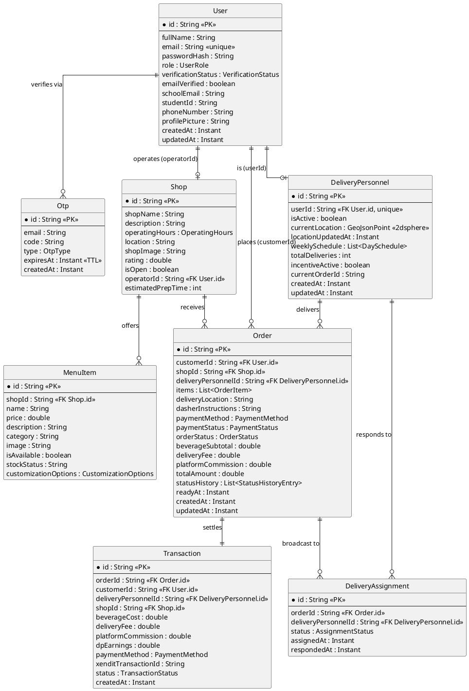

---

## 8. Class Diagram (Service Layer)

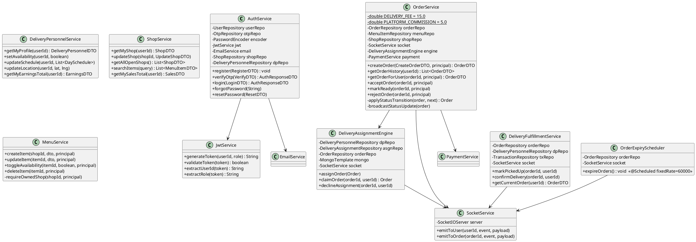

---

## 9. Sequence Diagrams

### 9.1 User Registration (with OTP)

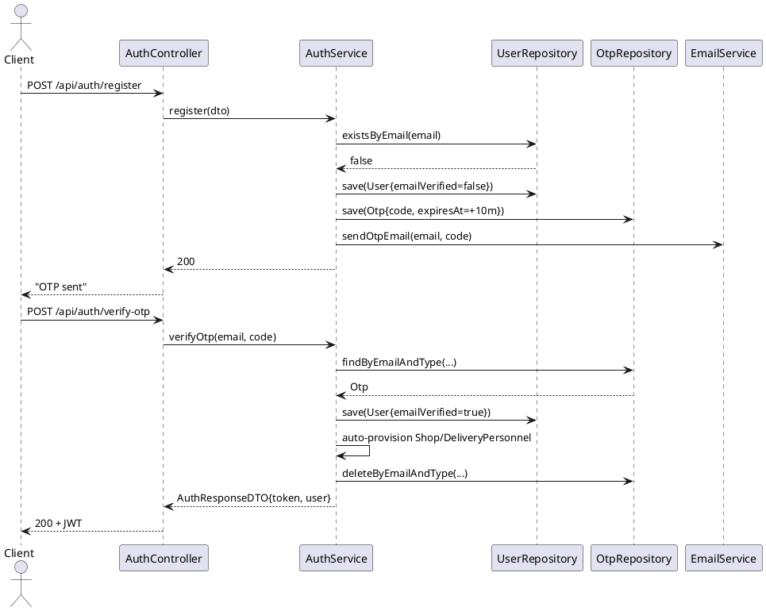

### 9.2 Login

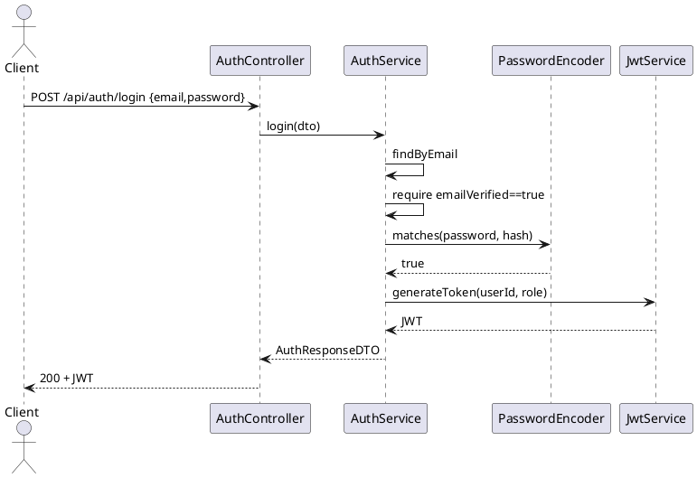

### 9.3 Beverage Ordering

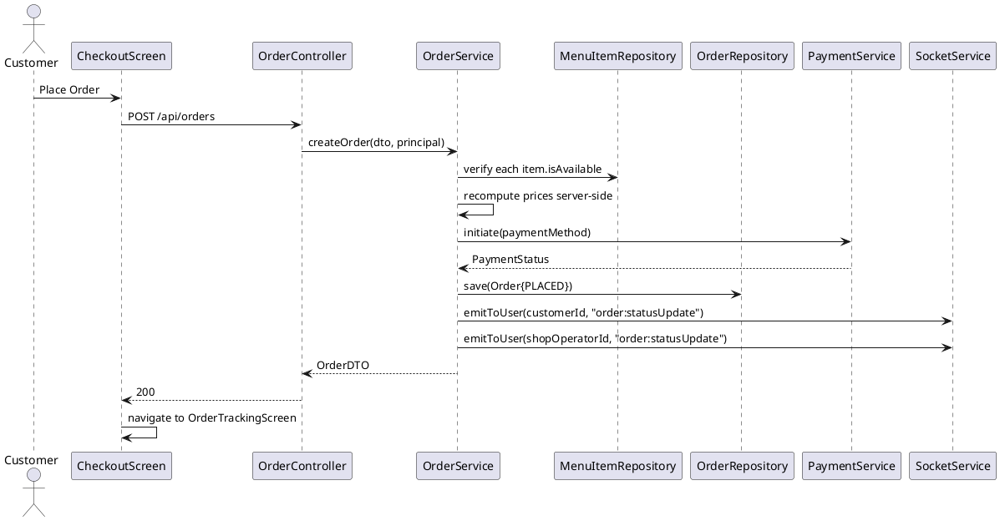

### 9.4 Delivery Assignment (Hybrid Marketplace)

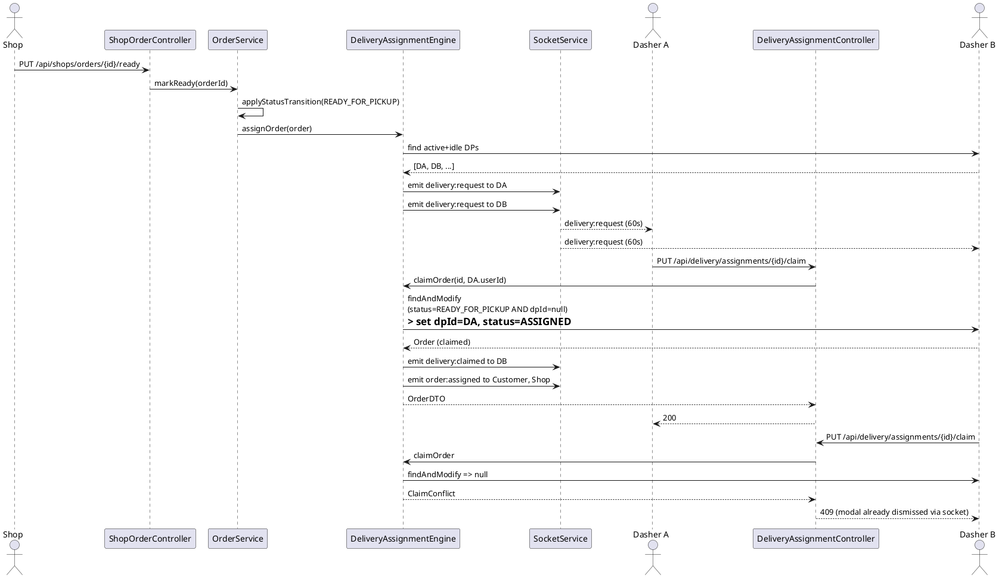

### 9.5 Payment Settlement on Delivery

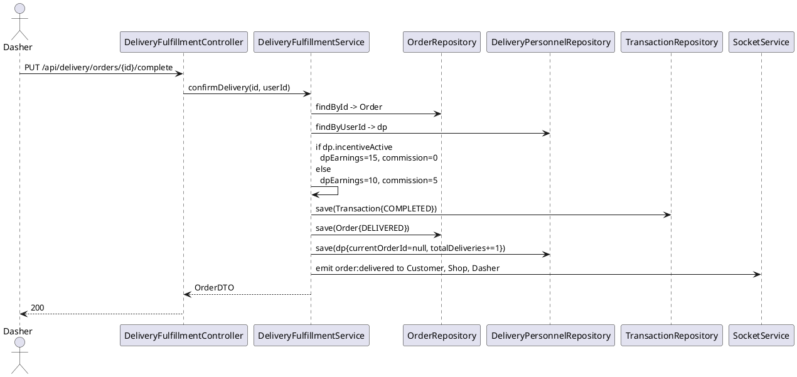

### 9.6 Real-Time Order Tracking (Customer)

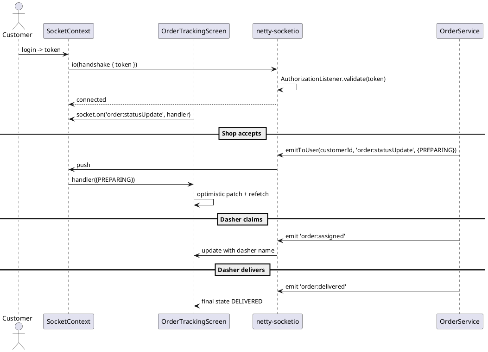

### 9.7 Shop Order Fulfillment

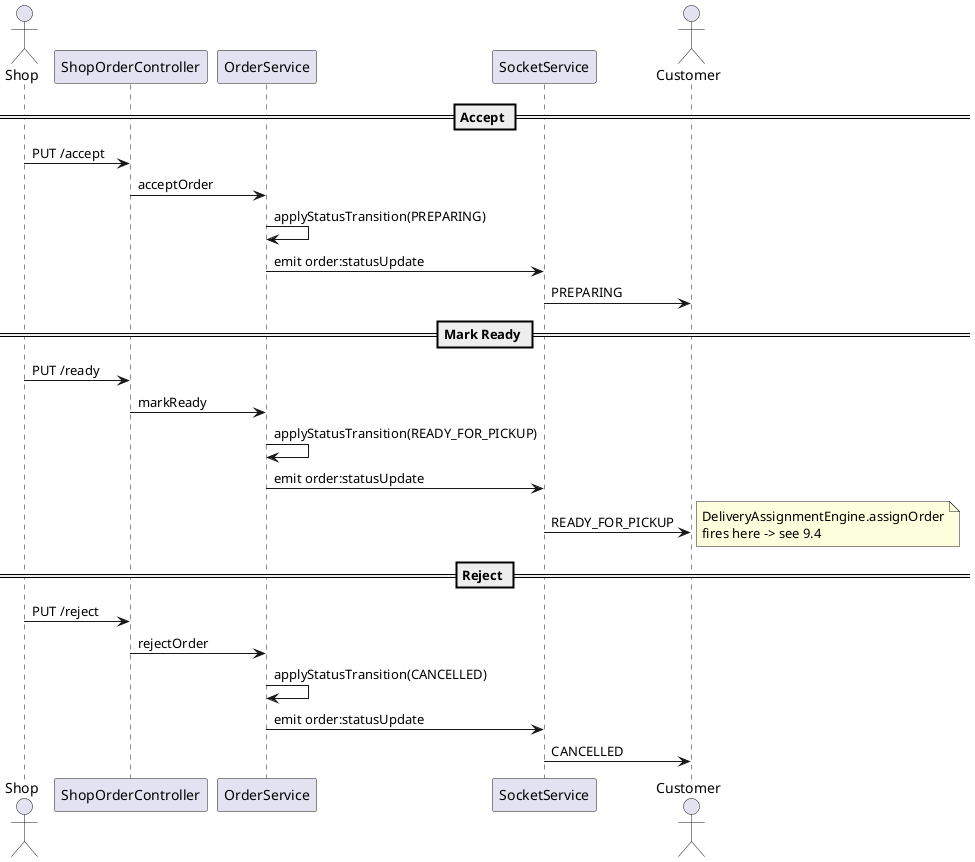

---

## 10. API Design Analysis

| Method | Path                                          | Auth                   | Body / Params              | Returns                    |
| ------ | --------------------------------------------- | ---------------------- | -------------------------- | -------------------------- |
| GET    | `/api/auth/ping`                              | none                   | —                          | 200                        |
| POST   | `/api/auth/register`                          | none                   | `RegisterDTO`              | 200                        |
| POST   | `/api/auth/verify-otp`                        | none                   | `{email,code}`             | `AuthResponseDTO`          |
| POST   | `/api/auth/login`                             | none                   | `{email,password}`         | `AuthResponseDTO`          |
| POST   | `/api/auth/resend-otp`                        | none                   | `{email,type}`             | 200                        |
| POST   | `/api/auth/forgot-password`                   | none                   | `{email}`                  | 200                        |
| POST   | `/api/auth/reset-password`                    | none                   | `{email,code,newPassword}` | 200                        |
| GET    | `/api/users/me`                               | Bearer                 | —                          | `UserDTO`                  |
| PUT    | `/api/users/me`                               | Bearer                 | `UpdateUserDTO`            | `UserDTO`                  |
| POST   | `/api/verification/send-otp`                  | Bearer                 | `{schoolEmail}`            | 200                        |
| POST   | `/api/verification/verify`                    | Bearer                 | `{code,studentId}`         | `UserDTO`                  |
| GET    | `/api/shops`                                  | Bearer                 | —                          | `List<ShopDTO>`            |
| GET    | `/api/shops/me`                               | Bearer (SHOP_OPERATOR) | —                          | `ShopDTO`                  |
| GET    | `/api/shops/{id}`                             | Bearer                 | —                          | `ShopDTO`                  |
| GET    | `/api/shops/{id}/menu`                        | Bearer                 | —                          | `List<MenuItemDTO>`        |
| GET    | `/api/shops/search?q=`                        | Bearer                 | —                          | `List<MenuItemDTO>`        |
| GET    | `/api/shops/sales/total`                      | Bearer (SHOP_OPERATOR) | —                          | `{totalSales,totalOrders}` |
| PUT    | `/api/shops/{id}`                             | Bearer (owner)         | `UpdateShopDTO`            | `ShopDTO`                  |
| POST   | `/api/menus`                                  | Bearer (owner)         | `CreateMenuItemDTO`        | `MenuItemDTO`              |
| PUT    | `/api/menus/{id}`                             | Bearer (owner)         | `MenuItemDTO`              | `MenuItemDTO`              |
| PATCH  | `/api/menus/{id}/availability`                | Bearer (owner)         | `{isAvailable}`            | `MenuItemDTO`              |
| DELETE | `/api/menus/{id}`                             | Bearer (owner)         | —                          | 204                        |
| POST   | `/api/orders`                                 | Bearer (CUSTOMER)      | `CreateOrderDTO`           | `OrderDTO`                 |
| GET    | `/api/orders/{orderId}`                       | Bearer                 | —                          | `OrderDTO`                 |
| GET    | `/api/orders/history`                         | Bearer                 | —                          | `List<OrderDTO>` (desc)    |
| POST   | `/api/orders/reorder/{orderId}`               | Bearer                 | —                          | cart payload               |
| GET    | `/api/shops/{shopId}/orders?statuses=...`     | Bearer (owner)         | —                          | `List<OrderDTO>`           |
| PUT    | `/api/shops/orders/{orderId}/accept`          | Bearer (owner)         | —                          | `OrderDTO`                 |
| PUT    | `/api/shops/orders/{orderId}/reject`          | Bearer (owner)         | —                          | `OrderDTO`                 |
| PUT    | `/api/shops/orders/{orderId}/ready`           | Bearer (owner)         | —                          | `OrderDTO`                 |
| GET    | `/api/delivery/me`                            | Bearer (DP)            | —                          | `DeliveryPersonnelDTO`     |
| GET    | `/api/delivery/earnings/total`                | Bearer (DP)            | —                          | `EarningsDTO`              |
| PUT    | `/api/delivery/availability`                  | Bearer (DP)            | `{isActive}`               | `DeliveryPersonnelDTO`     |
| PUT    | `/api/delivery/schedule`                      | Bearer (DP)            | `List<DaySchedule>`        | `DeliveryPersonnelDTO`     |
| PUT    | `/api/delivery/location`                      | Bearer (DP)            | `{lat,lng}`                | 200                        |
| PUT    | `/api/delivery/assignments/{orderId}/accept`  | Bearer (DP)            | —                          | `OrderDTO`                 |
| PUT    | `/api/delivery/assignments/{orderId}/claim`   | Bearer (DP)            | —                          | `OrderDTO` or 409          |
| PUT    | `/api/delivery/assignments/{orderId}/decline` | Bearer (DP)            | —                          | 200                        |
| GET    | `/api/delivery/orders/available`              | Bearer (DP)            | —                          | `List<OrderDTO>`           |
| GET    | `/api/delivery/orders/history`                | Bearer (DP)            | —                          | `List<OrderDTO>`           |
| GET    | `/api/delivery/orders/current`                | Bearer (DP)            | —                          | `OrderDTO` or 204          |
| PUT    | `/api/delivery/orders/{orderId}/pickup`       | Bearer (DP)            | —                          | `OrderDTO`                 |
| PUT    | `/api/delivery/orders/{orderId}/complete`     | Bearer (DP)            | —                          | `OrderDTO`                 |

**Design observations**

- REST is verb-via-path-segment for state transitions (`/accept`, `/ready`, `/claim`) — pragmatic for a finite state machine, less RESTful-purist than `PATCH {state:...}`.
- All mutating endpoints require Bearer JWT; role/ownership is enforced in services via `requireShopOperator`, `requireOwnedShop`, `requireDeliveryPersonnel` guards.
- Realtime is a separate orthogonal channel; clients do not subscribe via REST.

---

## 11. Security Architecture

| Concern                              | Mechanism                                                                                                                                                                        |
| ------------------------------------ | -------------------------------------------------------------------------------------------------------------------------------------------------------------------------------- |
| **Password storage**                 | BCrypt via `PasswordEncoder` bean in `SecurityConfig`.                                                                                                                           |
| **Token issuance**                   | `JwtService` mints `HS256` JWTs (subject=userId, claim=role, 7-day expiry).                                                                                                      |
| **Stateless auth**                   | `SecurityConfig` sets `SessionCreationPolicy.STATELESS`; `JwtAuthenticationFilter` extracts the bearer token on every request.                                                   |
| **WebSocket auth**                   | `AuthorizationListener` validates `query.token`; returns `FAILED_AUTHORIZATION` to drop the handshake.                                                                           |
| **Role enforcement**                 | Service-layer `requireXxx(principal)` guards; controllers do not branch on roles directly.                                                                                       |
| **Ownership enforcement**            | `MenuService.requireOwnedShop`; `OrderService` verifies `principal.userId == order.customerId` for customer routes; shop endpoints verify `principal.userId == shop.operatorId`. |
| **Email verification gate**          | `AuthService.login` rejects unverified accounts.                                                                                                                                 |
| **School OTP**                       | `VerificationService.sendSchoolOtp` enforces `@cit.edu`.                                                                                                                         |
| **Student-ID validation**            | Regex `^\d{2}-\d{4}-\d{3}$` in `VerificationService`.                                                                                                                            |
| **OTP lifecycle**                    | `Otp.expiresAt` carries MongoDB TTL index `expireAfter="0s"`.                                                                                                                    |
| **Atomic race-condition prevention** | `MongoTemplate.findAndModify` in `claimOrder` prevents double-assignment.                                                                                                        |
| **Mid-delivery integrity**           | `DeliveryPersonnelService.setAvailability` blocks toggling off while `currentOrderId != null`.                                                                                   |
| **Server-side price recomputation**  | `OrderService.createOrder` recalculates `unitPrice = base + sizeMod + Σ addOn` server-side; client-side totals are advisory only.                                                |
| **CORS / origins**                   | `SecurityConfig` configures a permissive dev origin; tighten on prod.                                                                                                            |
| **Secret hygiene**                   | `application.properties` excluded; Atlas URI scrubbed (commit `a729451`).                                                                                                        |
| **Transport**                        | Currently HTTP for dev (LAN IP); production target HTTPS.                                                                                                                        |

**Known security gaps** (intentional / for capstone scope):

- No rate-limiting on `/api/auth/login`, `/api/auth/register`, OTP endpoints.
- JWT secret is a static config value, not rotated.
- Socket.IO transport allows `polling` fallback — fine, but plaintext in dev.
- No audit log table; status history is per-order only.

---

## 12. Data Flow Analysis

### 12.1 Order placement → delivery (end-to-end)

```
Customer (CheckoutScreen)
  └── POST /api/orders ───────────► OrderController
                                       └── OrderService.createOrder
                                            ├── validate shop.isOpen
                                            ├── validate menuItem.isAvailable
                                            ├── recompute prices
                                            ├── PaymentService.initiate
                                            ├── OrderRepository.save(PLACED)
                                            └── SocketService.emitToUser(customer, shopOperator)
                                                  │
Shop (OrderQueueScreen) ◄────── order:statusUpdate
  └── PUT /accept ─────────────► applyStatusTransition(PREPARING) ──► emit
  └── PUT /ready  ─────────────► applyStatusTransition(READY_FOR_PICKUP)
                                    └── DeliveryAssignmentEngine.assignOrder
                                          └── broadcast delivery:request to all idle+active DPs
                                                  │
Dasher (IncomingOrderModal) ◄── delivery:request (60s countdown)
  └── PUT /claim ──────────────► claimOrder (atomic findAndModify)
                                    ├── emit delivery:claimed (losers)
                                    └── emit order:assigned (customer, shop)
  └── PUT /pickup ─────────────► OUT_FOR_DELIVERY ──► emit
  └── PUT /complete ───────────► confirmDelivery
                                    ├── Transaction.save(dpEarnings, commission)
                                    ├── Order.save(DELIVERED)
                                    └── emit order:delivered

Background: OrderExpiryScheduler @60s
  └── orders WHERE status=READY_FOR_PICKUP AND readyAt < now-10m
        └── CANCELLED ──► emit
```

### 12.2 Authentication

```
Client → POST /register → User(PLACED in DB, unverified) + OTP issued → email
Client → POST /verify-otp → User.emailVerified=true → auto-provision Shop/DP → JWT
Client stores JWT in expo-secure-store
Every REST call: Authorization: Bearer <jwt> → JwtAuthenticationFilter → SecurityContext
Socket handshake: ?token=<jwt> → AuthorizationListener → bind userId
```

### 12.3 Realtime fan-out matrix

| Event                    | Producer                                     | Recipients                                               |
| ------------------------ | -------------------------------------------- | -------------------------------------------------------- |
| `order:statusUpdate`     | `OrderService.applyStatusTransition`         | customerId, shopOperatorId, deliveryPersonnelId (if set) |
| `order:assigned`         | `DeliveryAssignmentEngine.claimOrder`        | customer, shop                                           |
| `order:delivered`        | `DeliveryFulfillmentService.confirmDelivery` | customer, shop, dasher                                   |
| `delivery:request`       | `DeliveryAssignmentEngine.assignOrder`       | all active+idle DPs                                      |
| `delivery:claimed`       | `DeliveryAssignmentEngine.claimOrder`        | all DPs that received the request except the winner      |
| `delivery:offer-expired` | `OrderExpiryScheduler`                       | original recipients                                      |

---

## 13. Dependency Analysis

### 13.1 Backend (`campusbrew-api/pom.xml`)

| Dependency                                         | Role                                                         |
| -------------------------------------------------- | ------------------------------------------------------------ |
| `spring-boot-starter-web`                          | REST controllers, embedded Tomcat.                           |
| `spring-boot-starter-data-mongodb`                 | Mongo repositories + `MongoTemplate`.                        |
| `spring-boot-starter-security`                     | Filter chain, `PasswordEncoder`.                             |
| `spring-boot-starter-mail`                         | SMTP `SimpleMailMessage` for OTP.                            |
| `spring-boot-starter-validation`                   | `@Valid` on DTOs.                                            |
| `io.jsonwebtoken:jjwt-api/impl/jackson:0.12.6`     | JWT issuance/parse.                                          |
| `com.corundumstudio.socketio:netty-socketio:2.0.9` | Server-side socket.io implementation.                        |
| `org.projectlombok:lombok`                         | Boilerplate reduction (with the Jackson `is`-prefix caveat). |

### 13.2 Frontend (`CampusBrew/package.json`)

| Dependency                                                                                       | Role                                                  |
| ------------------------------------------------------------------------------------------------ | ----------------------------------------------------- |
| `expo:~54.x`                                                                                     | Managed RN runtime.                                   |
| `react-native:0.81.5`, `react:19`                                                                | Core.                                                 |
| `@react-navigation/native`, `@react-navigation/native-stack`, `@react-navigation/bottom-tabs` v7 | Navigation.                                           |
| `socket.io-client`                                                                               | Realtime.                                             |
| `expo-secure-store`                                                                              | JWT persistence.                                      |
| `expo-location`                                                                                  | Dasher location updates.                              |
| `react-native-safe-area-context`                                                                 | Insets (critical for modal under iOS dynamic island). |
| `react-native-gesture-handler`, `react-native-reanimated`                                        | Animated bottom-sheet, PanResponder fallbacks.        |
| `@expo/vector-icons` (Ionicons)                                                                  | Icon system.                                          |

### 13.3 Coupling notes

- Backend has **zero** dependency on the Expo client; communication is purely REST + Socket.IO.
- Frontend has **zero** native modules outside Expo's prebuild — single APK/IPA buildable via EAS.
- `DeliveryAssignmentEngine` is the most coupled service (depends on `DeliveryPersonnelRepository`, `DeliveryAssignmentRepository`, `OrderRepository`, `MongoTemplate`, `SocketService`); justified by its role as the marketplace coordinator.

---

## 14. Code Quality Evaluation

| Dimension                | Observation                                                                                                                                                                                                                                            |
| ------------------------ | ------------------------------------------------------------------------------------------------------------------------------------------------------------------------------------------------------------------------------------------------------ |
| **Naming**               | Consistent and descriptive. `applyStatusTransition`, `requireOwnedShop`, `OrderExpiryScheduler`, `DeliveryAssignmentEngine`. Domain language matches the SRS.                                                                                          |
| **Layering**             | Clean — no controller bypasses services; no service reaches into another aggregate's repository directly except in well-justified places (e.g. `AuthService` provisioning a `Shop`).                                                                   |
| **DTO discipline**       | DTOs separate from entities; primitive `boolean isXxx` fields consistently annotated with `@JsonProperty("isXxx")` to defeat Lombok+Jackson's stripping (a documented team rule).                                                                      |
| **Idempotency**          | State transitions guarded by checks ("must be PLACED to accept"); claim is CAS via `findAndModify`.                                                                                                                                                    |
| **Error handling**       | Custom exceptions surfaced as 4xx via a global handler. Frontend services normalize fetch errors into typed messages displayed in alert/banner.                                                                                                        |
| **Realtime correctness** | Race fixed: `applyStatusTransition` saves _then_ broadcasts. Belt-and-suspenders 10s poll on shop dashboard for missed events.                                                                                                                         |
| **UX resilience**        | `ConfirmDialog` modal pattern (replaces `Alert.alert` whose `onPress` callbacks silently drop on Expo Web). `IncomingOrderModal` accounts for safe-area in iOS native window.                                                                          |
| **Magic numbers**        | `DELIVERY_FEE`, `PLATFORM_COMMISSION`, incentive amounts, expiry minutes are constants — but some live in code (`OrderService`) and some in `application.properties` (`delivery.orderExpiry.minutes`); a single `PricingConfig` bean would centralize. |
| **Tests**                | Capstone scope — no automated test suite yet. Manual + dual-emulator integration testing.                                                                                                                                                              |
| **Logging**              | `System.out`/`log.warn` in critical paths (`DeliveryAssignmentEngine`, socket connect_error on the client). Production would want structured logging (Logback JSON + a correlation id).                                                                |
| **Security posture**     | Strong basics (BCrypt, JWT, role guards, server-side price recomputation, atomic claim) — gaps as listed in §11.                                                                                                                                       |
| **Comment hygiene**      | Comments explain "why" (e.g. polling guard, polling vs ws fallback in `SocketContext`), not "what".                                                                                                                                                    |

---

## 15. Final Summary

CampusBrew is a tightly-scoped, role-aware, realtime-first delivery platform. Its strongest architectural choices are:

1. **A single hybrid marketplace primitive** (`DeliveryAssignmentEngine`) handling push offers, atomic claims, and graceful failure (`delivery:claimed` to losers, scheduled expiry to nobody), avoiding the complexity of full proximity-based dispatch while remaining sound under concurrency.
2. **Status-driven server-broadcast pattern** in `OrderService.applyStatusTransition` that guarantees the persisted state and the wire event always agree (save-then-emit).
3. **Self-healing role provisioning** in `AuthService` plus `getMyShop` / `getMyProfile` ensures shop operators and dashers never see a partial-state account.
4. **Dual-axis safety net** for realtime: socket listeners on every dashboard _plus_ a 10-second focus-effect poll for missed events.
5. **Clean role separation in a single binary** — `AppNavigator` selects one of `CustomerStack`, `ShopStack`, `DeliveryStack` from the JWT claim, so one codebase ships three apps.

Areas that would naturally evolve post-capstone: rate-limiting on auth endpoints, full Xendit integration replacing the `PENDING_COD/PENDING` stub in `PaymentService`, structured logging + tracing, automated test coverage (especially around the CAS claim and the expiry scheduler), and a `PricingConfig` bean to centralize the `DELIVERY_FEE`/`PLATFORM_COMMISSION`/incentive numbers.

The codebase is internally consistent, follows the SRS/SDD it was scoped against, and demonstrates a real understanding of the operational hazards of marketplace assignment — most notably the explicit fix for the Lombok+Jackson `is`-prefix bug, the geo index initializer that compensates for Spring Data's dropped auto-index behavior, and the iOS Modal/SafeAreaProvider fix for the incoming-order popup. Those are the kinds of fixes you only make after the bugs bite — which is the signature of a system that actually got built and tested, not just designed.

---

## 16. System Architecture Diagram

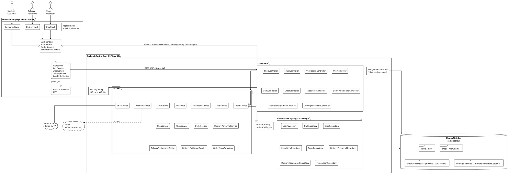

---

## 17. Updated System Components, Class Diagrams, and Sequence Diagrams (per submodule)

> Notes on the diagrams: class diagrams show only the fields/methods relevant to that submodule's behavior (not every Lombok-generated getter). Sequence diagrams elide low-value frames (DTO mapping, repository `save` returning the same entity) to keep the focus on the operationally meaningful interactions. Where a backend component is shared across submodules (e.g. `OrderService`, `SocketService`), each submodule shows only the methods it actually invokes.

### 17.1 Module 1 — Authentication and User Management

#### 1.1 User Registration

**System Components**

| Layer    | Component                         | Description                                                                                |
| -------- | --------------------------------- | ------------------------------------------------------------------------------------------ |
| Frontend | `SignUpScreen`                    | Captures fullName, email, password, role (custom modal dropdown).                          |
| Frontend | `AuthService.register`            | `POST /api/auth/register`; surfaces typed error.                                           |
| Backend  | `AuthController.register`         | Validates DTO, delegates.                                                                  |
| Backend  | `AuthService.register`            | Hashes password (BCrypt), creates `User`, issues `Otp` of type `REGISTRATION`, sends mail. |
| Backend  | `EmailService`                    | SMTP send via Gmail.                                                                       |
| Backend  | `UserRepository`, `OtpRepository` | Persistence.                                                                               |

```plantuml
@startuml Class_1_1
!theme plain
class AuthController {
  +register(RegisterRequest): ResponseEntity
}
class AuthService {
  -userRepo: UserRepository
  -otpRepo: OtpRepository
  -emailService: EmailService
  -passwordEncoder: PasswordEncoder
  +register(RegisterRequest): void
}
class User {
  -id: String
  -fullName: String
  -email: String <<unique>>
  -passwordHash: String
  -role: UserRole
  -verificationStatus: VerificationStatus
  -emailVerified: boolean
}
class Otp {
  -id: String
  -email: String
  -code: String
  -type: OtpType
  -expiresAt: Date <<TTL>>
}
enum UserRole { CUSTOMER DELIVERY_PERSONNEL SHOP_OPERATOR }
enum OtpType { REGISTRATION PASSWORD_RESET VERIFICATION }

AuthController --> AuthService
AuthService --> User
AuthService --> Otp
User -- UserRole
Otp -- OtpType
@enduml
```

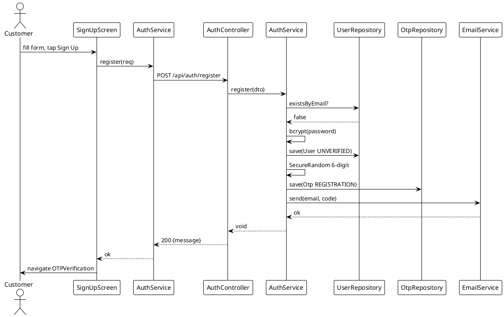

#### 1.2 User Login

**System Components**

| Layer    | Component              | Description                                                                                             |
| -------- | ---------------------- | ------------------------------------------------------------------------------------------------------- |
| Frontend | `LoginScreen`          | Email + password; show/hide password toggle.                                                            |
| Frontend | `AuthContext.login`    | Calls service, stores JWT in `expo-secure-store`.                                                       |
| Frontend | `AppNavigator`         | Routes by `user.role` (one of three stacks).                                                            |
| Backend  | `AuthController.login` | Returns `AuthResponse` with JWT.                                                                        |
| Backend  | `AuthService.login`    | Verifies BCrypt; provisions `Shop`/`DeliveryPersonnel` if first SHOP_OPERATOR/DELIVERY_PERSONNEL login. |
| Backend  | `JwtService`           | Signs token with `jwt.secret`, 24h expiry.                                                              |

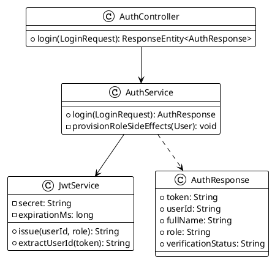

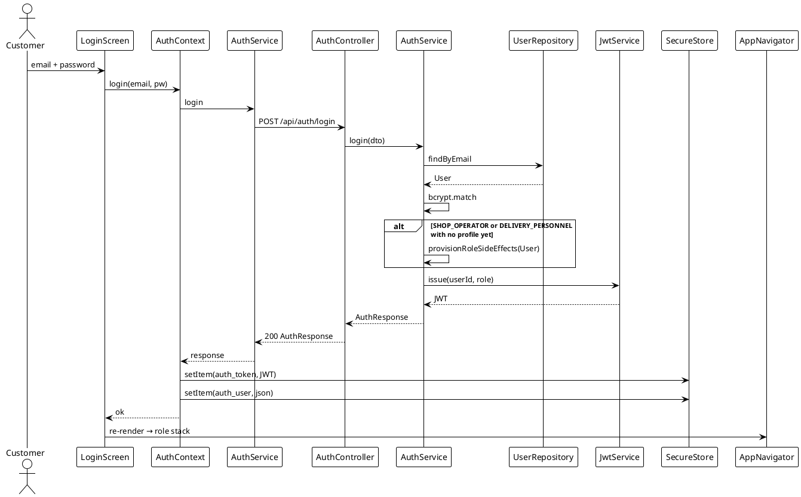

#### 1.3 Forgot Password

**System Components**

| Layer    | Component                                       | Description                                                    |
| -------- | ----------------------------------------------- | -------------------------------------------------------------- |
| Frontend | `ForgotPasswordScreen` / `ResetPasswordScreen`  | Two-step: enter email → enter code + new password.             |
| Frontend | `AuthService.forgotPassword` / `.resetPassword` | REST.                                                          |
| Backend  | `AuthController`                                | Two endpoints.                                                 |
| Backend  | `AuthService`                                   | Issues `Otp` of type `PASSWORD_RESET`; validates and rehashes. |
| Backend  | `EmailService`                                  | Send reset code.                                               |

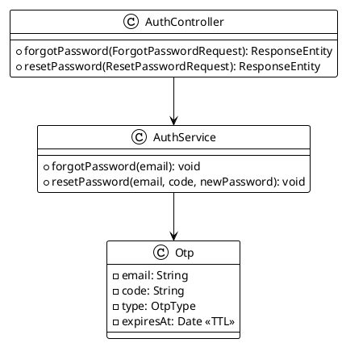

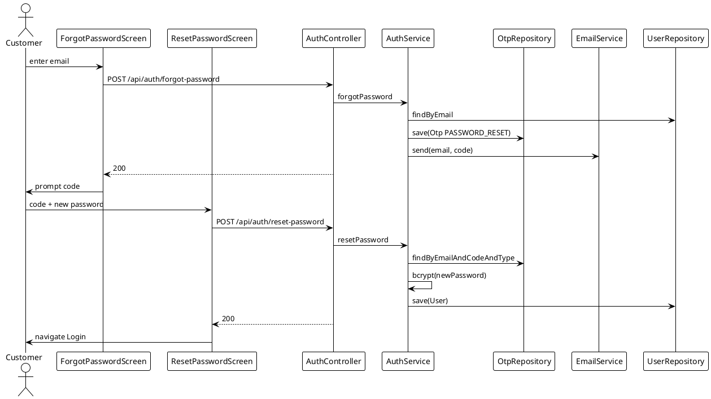

#### 1.4 Account Verification (CIT-U email + Student ID → unlock COD)

**System Components**

| Layer    | Component                   | Description                                                                     |
| -------- | --------------------------- | ------------------------------------------------------------------------------- |
| Frontend | `AccountVerificationScreen` | `@cit.edu` email + OTP + student ID.                                            |
| Frontend | `VerifiedSuccessScreen`     | Gold COD-unlocked card.                                                         |
| Backend  | `VerificationController`    | `/api/verification/send-otp`, `/api/verification/verify`.                       |
| Backend  | `VerificationService`       | Issues OTP type `VERIFICATION`, validates, flips `verificationStatus=VERIFIED`. |

```plantuml
@startuml Class_1_4
!theme plain
class VerificationController {
  +sendOtp(SchoolEmailRequest, JWT): ResponseEntity
  +verify(VerificationRequest, JWT): ResponseEntity
}
class VerificationService {
  -userRepo: UserRepository
  -otpRepo: OtpRepository
  -emailService: EmailService
  +sendOtp(userId, schoolEmail): void
  +verify(userId, schoolEmail, otp, studentId): UserDTO
}
class User {
  -schoolEmail: String <<unique sparse>>
  -studentId: String <<unique sparse>>
  -verificationStatus: VerificationStatus
}
enum VerificationStatus { UNVERIFIED VERIFIED }
VerificationController --> VerificationService
VerificationService --> User
@enduml
```

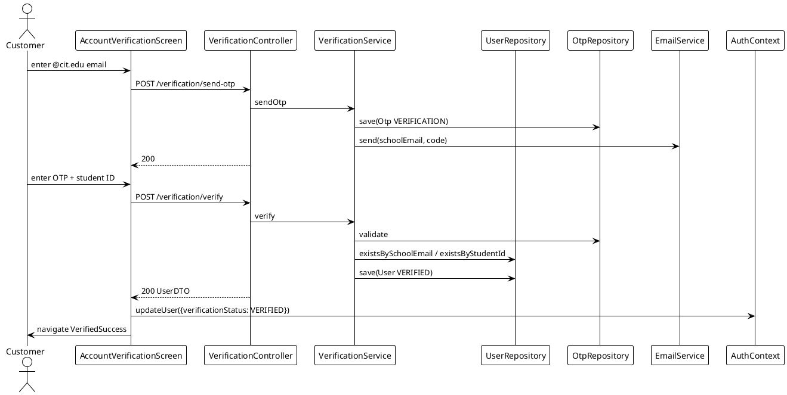

#### 1.5 User Profile Management

**System Components**

| Layer    | Component           | Description                                               |
| -------- | ------------------- | --------------------------------------------------------- |
| Frontend | `ProfileScreen`     | Badge, verify link, logout.                               |
| Frontend | `EditProfileScreen` | 5 editable fields + camera overlay (`expo-image-picker`). |
| Backend  | `UserController`    | `GET/PUT /api/users/me`.                                  |
| Backend  | `UserService`       | Read + partial update.                                    |

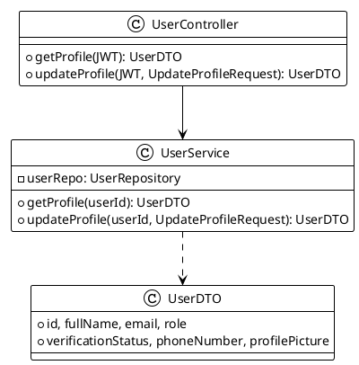

```plantuml
@startuml Seq_1_5
!theme plain
actor User
participant ProfileScreen as PS
participant EditProfileScreen as EPS
participant UserController as UC
participant UserService as US
participant UserRepository as UR

User -> PS: open Profile tab
PS -> UC: GET /api/users/me
UC -> US: getProfile
US -> UR: findById
UC --> PS: UserDTO

User -> PS: tap Edit
PS -> EPS: navigate
User -> EPS: edit fields, tap Save
EPS -> UC: PUT /api/users/me
UC -> US: updateProfile
US -> UR: save
UC --> EPS: UserDTO
EPS -> AuthContext: updateUser(updates)
EPS -> User: success → back to Profile
@enduml
```

---

### 17.2 Module 2 — Beverage Ordering

#### 2.1 Shop and Menu Browsing

**System Components**

| Layer    | Component        | Description                                                                                                           |
| -------- | ---------------- | --------------------------------------------------------------------------------------------------------------------- |
| Frontend | `HomeScreen`     | Search, Partner Shops carousel, category chips, Popular Picks. Pulls from `ShopService.getShops` + first shop's menu. |
| Frontend | `ShopMenuScreen` | Categorized menu, stock badges (In/Low/Out), cart icon w/ badge.                                                      |
| Frontend | `ShopService`    | `getShops`, `getShop`, `getMenu`, `searchItems`.                                                                      |
| Backend  | `ShopController` | `GET /api/shops`, `GET /api/shops/{id}`, `GET /api/shops/{id}/menu`, `GET /api/shops/search`.                         |
| Backend  | `ShopService`    | Returns DTOs from `shops` and `menuItems` collections.                                                                |

```plantuml
@startuml Class_2_1
!theme plain
class ShopController {
  +getAllShops(openOnly: boolean): List<ShopDTO>
  +getShop(id: String): ShopDTO
  +getShopMenu(id: String): List<MenuItemDTO>
  +searchItems(q: String): List<MenuItemDTO>
}
class ShopService {
  -shopRepo: ShopRepository
  -menuItemRepo: MenuItemRepository
  +getAllActiveShops(): List<ShopDTO>
  +getShopMenu(shopId): List<MenuItemDTO>
  +requireMenuItem(id): MenuItem
}
class Shop {
  -id, shopName, description, location, shopImage
  -operatingHours: OperatingHours
  -rating: double
  -isOpen: boolean
  -operatorId: String
}
class MenuItem {
  -id, shopId, name, price, description, category, image
  -isAvailable: boolean
  -stockStatus: String
  -customizationOptions: CustomizationOptions
}
class CustomizationOptions {
  -sizes: List<SizeOption>
  -sugarLevels: List<String>
  -temperatures: List<String>
  -addOns: List<AddOnOption>
}
ShopController --> ShopService
ShopService --> Shop
ShopService --> MenuItem
MenuItem *-- CustomizationOptions
Shop "1" --> "*" MenuItem : shopId
@enduml
```

```plantuml
@startuml Seq_2_1
!theme plain
actor Customer
participant HomeScreen as HS
participant ShopMenuScreen as SMS
participant ShopService as FE
participant ShopController as SC
participant ShopService as BE
participant ShopRepository as SR
participant MenuItemRepository as MR

Customer -> HS: open app
HS -> FE: getShops(false)
FE -> SC: GET /api/shops
SC -> BE: getAllShops
BE -> SR: findAll()
BE --> SC: List<ShopDTO>
SC --> FE: 200
HS -> FE: getMenu(firstShop.id)
FE -> SC: GET /api/shops/{id}/menu
SC -> BE: getShopMenu
BE -> MR: findByShopIdOrderByCategory
BE --> SC: List<MenuItemDTO>
SC --> FE: 200
HS -> Customer: render shops + popular picks

Customer -> HS: tap a shop card
HS -> SMS: navigate(shopId)
SMS -> FE: getShop + getMenu
SMS -> Customer: render shop menu
@enduml
```

#### 2.2 Order Placement with Item Customization

**System Components**

| Layer    | Component                                  | Description                                                                                                                                                                                 |
| -------- | ------------------------------------------ | ------------------------------------------------------------------------------------------------------------------------------------------------------------------------------------------- |
| Frontend | `CustomizeItemScreen`                      | Size/sugar/temperature pills, add-ons checklist, qty stepper, dynamic price button.                                                                                                         |
| Frontend | `CheckoutScreen`                           | Cart, delivery location, dasher instructions, payment method (COD gated behind verified status), order summary.                                                                             |
| Frontend | `CartContext`                              | Single-shop cart (switch-shop prompt on mismatch).                                                                                                                                          |
| Frontend | `OrderService.createOrder`                 | `POST /api/orders` with JWT.                                                                                                                                                                |
| Backend  | `OrderController.createOrder`              | Validates and delegates.                                                                                                                                                                    |
| Backend  | `OrderService.createOrder`                 | Re-prices server-side (size modifier + add-ons), enforces COD-requires-VERIFIED, builds `Order` with `PLACED` status, delegates to `PaymentService`, saves, emits `order:new` to shop room. |
| Backend  | `PaymentService.initiate`                  | COD → `PENDING_COD`; GCash → `PENDING` (Xendit stub).                                                                                                                                       |
| Backend  | `SocketService.emitToOrder` / `emitToUser` | Realtime broadcast.                                                                                                                                                                         |

```plantuml
@startuml Class_2_2
!theme plain
class OrderController {
  +createOrder(JWT, CreateOrderDTO): OrderDTO
}
class OrderService {
  -orderRepo: OrderRepository
  -shopService: ShopService
  -userRepo: UserRepository
  -paymentService: PaymentService
  -socketService: SocketService
  +createOrder(userId, CreateOrderDTO): OrderDTO
  -computeUnitPrice(MenuItem, size, addOns): double
  +applyStatusTransition(Order, OrderStatus): void
}
class PaymentService {
  +initiate(Order): PaymentInitResult
}
class CreateOrderDTO {
  +shopId: String
  +items: List<CreateOrderItemDTO>
  +deliveryLocation: String
  +dasherInstructions: String
  +paymentMethod: PaymentMethod
}
class Order {
  -id, customerId, shopId, deliveryPersonnelId
  -items: List<OrderItem>
  -deliveryLocation, dasherInstructions
  -paymentMethod: PaymentMethod
  -paymentStatus: PaymentStatus
  -orderStatus: OrderStatus
  -beverageSubtotal, deliveryFee, platformCommission, totalAmount
  -statusHistory: List<StatusHistoryEntry>
  -createdAt, updatedAt
}
class OrderItem {
  -menuItemId, itemName, quantity
  -size, sugarLevel, temperature
  -addOns: List<String>
  -unitPrice, totalPrice
}
enum OrderStatus { PLACED PREPARING READY_FOR_PICKUP ASSIGNED OUT_FOR_DELIVERY DELIVERED CANCELLED }
enum PaymentMethod { GCASH COD }
enum PaymentStatus { PENDING PAID_GCASH PENDING_COD PAID_COD REFUNDED }

OrderController --> OrderService
OrderService --> PaymentService
OrderService --> Order
Order *-- OrderItem
Order -- OrderStatus
Order -- PaymentMethod
Order -- PaymentStatus
@enduml
```

```plantuml
@startuml Seq_2_2
!theme plain
actor Customer
participant CheckoutScreen as CS
participant CartContext as Cart
participant OrderService as FE
participant OrderController as OC
participant OrderService as OS
participant ShopService as SS
participant PaymentService as PS
participant OrderRepository as OR
participant SocketService as Sock

Customer -> CS: enter location, select payment, Confirm
CS -> Cart: items + shopId
CS -> FE: createOrder(req, JWT)
FE -> OC: POST /api/orders
OC -> OS: createOrder(userId, dto)
OS -> OS: validate (non-empty, single shop)
loop for each line item
  OS -> SS: requireMenuItem(menuItemId)
  OS -> OS: assert shopId match + isAvailable
  OS -> OS: computeUnitPrice (size mod + addOns)
end
OS -> OS: total = subtotal + DELIVERY_FEE + PLATFORM_COMMISSION
alt paymentMethod == COD
  OS -> OS: assert user.verificationStatus == VERIFIED
end
OS -> PS: initiate(order)
PS --> OS: PaymentInitResult(status, paymentUrl?)
OS -> OR: save(Order PLACED)
OS -> Sock: emitToOrder(orderId, "order:new", payload)
OS -> Sock: emitToUser(shopOperatorId, "order:new", payload)
OS --> OC: OrderDTO
OC --> FE: 201
FE --> CS: ok
CS -> Cart: clearCart
CS -> Customer: navigate OrderTracking
@enduml
```

#### 2.3 Quick Reorder from Order History

**System Components**

| Layer    | Component                              | Description                                                                                                                         |
| -------- | -------------------------------------- | ----------------------------------------------------------------------------------------------------------------------------------- |
| Frontend | `OrderHistoryScreen`                   | Paginated list w/ Status badge + Reorder. Belt-and-suspenders client sort by `createdAt DESC`.                                      |
| Frontend | `ReorderCartScreen`                    | Pre-filled cart; flags unavailable items + price changes; quantity steppers.                                                        |
| Frontend | `OrderService.getHistory` / `.reorder` | REST clients.                                                                                                                       |
| Backend  | `OrderController`                      | `GET /api/orders/history?page=`, `POST /api/orders/reorder/{orderId}`.                                                              |
| Backend  | `OrderService.prepareReorder`          | Loads past order, re-validates each line against current `menuItems`, builds `ReorderDTO` with `unavailableItems` + `priceChanges`. |

```plantuml
@startuml Class_2_3
!theme plain
class OrderController {
  +getOrderHistory(JWT, page): Page<OrderDTO>
  +reorder(JWT, orderId): ReorderDTO
}
class OrderService {
  +getOrderHistory(userId, page): Page<OrderDTO>
  +prepareReorder(userId, orderId): ReorderDTO
}
class ReorderDTO {
  +shopId, shopName
  +items: List<ReorderItemDTO>
  +unavailableItems: List<String>
  +priceChanges: List<PriceChangeNote>
}
class ReorderItemDTO {
  +menuItemId, itemName, image
  +quantity, size, sugarLevel, temperature, addOns
  +currentUnitPrice, currentTotalPrice
  +isAvailable: boolean
}
class PriceChangeNote {
  +itemName, previousPrice, currentPrice
}
OrderController --> OrderService
OrderService ..> ReorderDTO
ReorderDTO *-- ReorderItemDTO
ReorderDTO *-- PriceChangeNote
@enduml
```

```plantuml
@startuml Seq_2_3
!theme plain
actor Customer
participant OrderHistoryScreen as OHS
participant ReorderCartScreen as RCS
participant OrderController as OC
participant OrderService as OS
participant OrderRepository as OR
participant ShopService as SS
participant CartContext as Cart

Customer -> OHS: open Orders tab
OHS -> OC: GET /api/orders/history?page=0
OC -> OS: getOrderHistory(userId, 0)
OS -> OR: findByCustomerIdOrderByCreatedAtDesc(page)
OC --> OHS: Page<OrderDTO>

Customer -> OHS: tap Reorder on an order
OHS -> OC: POST /api/orders/reorder/{orderId}
OC -> OS: prepareReorder
OS -> OR: findById
loop each past OrderItem
  OS -> SS: requireMenuItem (may not exist)
  alt unavailable
    OS -> OS: add to unavailableItems
  else available
    OS -> OS: computeUnitPrice (current)
    opt price changed
      OS -> OS: add PriceChangeNote
    end
  end
end
OC --> OHS: ReorderDTO
OHS -> RCS: navigate(payload)
Customer -> RCS: adjust quantities, Proceed
RCS -> Cart: replaceCart(items, shopId, shopName)
RCS -> Customer: navigate Checkout
@enduml
```

---

### 17.3 Module 3 — Delivery Assignment and Fulfillment

#### 3.1 Delivery Personnel Availability Scheduling

**System Components**

| Layer    | Component                     | Description                                                                                                           |
| -------- | ----------------------------- | --------------------------------------------------------------------------------------------------------------------- |
| Frontend | `DeliveryDashboardScreen`     | Active/Inactive toggle, summary stats, current-order banner.                                                          |
| Frontend | `ScheduleSettingsScreen`      | Weekly day-of-week toggles + time pickers.                                                                            |
| Frontend | `DeliveryService`             | `setAvailability`, `updateSchedule`, `updateLocation`, `getMyProfile`.                                                |
| Backend  | `DeliveryPersonnelController` | `PUT /api/delivery/availability`, `PUT /api/delivery/schedule`, `PUT /api/delivery/location`, `GET /api/delivery/me`. |
| Backend  | `DeliveryPersonnelService`    | Persists toggle/schedule/location; refuses going inactive while `currentOrderId` is set.                              |

```plantuml
@startuml Class_3_1
!theme plain
class DeliveryPersonnelController {
  +getMyProfile(JWT): DeliveryPersonnelDTO
  +setAvailability(JWT, AvailabilityToggleDTO): DeliveryPersonnelDTO
  +updateSchedule(JWT, UpdateScheduleDTO): DeliveryPersonnelDTO
  +updateLocation(JWT, UpdateLocationDTO): DeliveryPersonnelDTO
}
class DeliveryPersonnelService {
  -dpRepo: DeliveryPersonnelRepository
  -userRepo: UserRepository
  +setAvailability(userId, isActive): DeliveryPersonnelDTO
  +updateSchedule(userId, List<DaySchedule>): DeliveryPersonnelDTO
  +updateLocation(userId, lon, lat): DeliveryPersonnelDTO
  -requireProfile(userId): DeliveryPersonnel
}
class DeliveryPersonnel {
  -id, userId
  -isActive: boolean
  -currentLocation: GeoJsonPoint
  -weeklySchedule: List<DaySchedule>
  -totalDeliveries: int
  -incentiveActive: boolean
  -currentOrderId: String
}
class DaySchedule {
  -dayOfWeek: String
  -enabled: boolean
  -startTime, endTime: String
}
DeliveryPersonnelController --> DeliveryPersonnelService
DeliveryPersonnelService --> DeliveryPersonnel
DeliveryPersonnel *-- DaySchedule
@enduml
```

```plantuml
@startuml Seq_3_1
!theme plain
actor Dasher
participant DeliveryDashboardScreen as DDS
participant ScheduleSettingsScreen as SSS
participant DeliveryService as FE
participant DeliveryPersonnelController as DPC
participant DeliveryPersonnelService as DPS
participant DeliveryPersonnelRepository as DPR

Dasher -> DDS: toggle Active
DDS -> FE: setAvailability(true)
FE -> DPC: PUT /api/delivery/availability
DPC -> DPS: setAvailability(userId, true)
DPS -> DPR: findByUserId
alt currentOrderId != null && !isActive
  DPS --> DPC: 400 "Complete current delivery first"
else
  DPS -> DPR: save(isActive=true)
  DPC --> DDS: 200 DTO
end

Dasher -> SSS: edit weekly schedule
SSS -> FE: updateSchedule(schedule)
FE -> DPC: PUT /api/delivery/schedule
DPC -> DPS: updateSchedule
DPS -> DPR: save(weeklySchedule)
DPC --> SSS: 200 DTO
@enduml
```

#### 3.2 Automated Delivery Assignment

**System Components**

| Layer    | Component                      | Description                                                                                                                                                                                                                                                                  |
| -------- | ------------------------------ | ---------------------------------------------------------------------------------------------------------------------------------------------------------------------------------------------------------------------------------------------------------------------------- |
| Frontend | `IncomingOrderModal`           | Push offer overlay with 45s countdown; Accept/Decline. iOS modal SafeAreaProvider fix.                                                                                                                                                                                       |
| Frontend | `AvailableDeliveriesScreen`    | Marketplace fallback list (any active dasher can claim).                                                                                                                                                                                                                     |
| Frontend | `SocketContext`                | Listens for `delivery:request`, `delivery:claimed`, `delivery:expired`.                                                                                                                                                                                                      |
| Backend  | `DeliveryAssignmentController` | `POST /api/delivery/accept/{orderId}`, `POST /api/delivery/decline/{orderId}`, `POST /api/delivery/claim/{orderId}`, `GET /api/delivery/available`.                                                                                                                          |
| Backend  | `DeliveryAssignmentEngine`     | Hybrid push + marketplace claim. Atomic CAS via `MongoTemplate.findAndModify`. Emits `delivery:request` to eligible dashers; on accept emits `delivery:claimed` to losers, `order:assigned` to shop + customer rooms. Auto-expires after `delivery.dispatch.timeoutSeconds`. |
| Backend  | `SocketService`                | Room broadcasts.                                                                                                                                                                                                                                                             |

```plantuml
@startuml Class_3_2
!theme plain
class DeliveryAssignmentController {
  +acceptAssignment(JWT, orderId): ResponseEntity
  +declineAssignment(JWT, orderId): ResponseEntity
  +claimFromMarketplace(JWT, orderId): ResponseEntity
  +listAvailable(JWT): List<OrderDTO>
}
class DeliveryAssignmentEngine {
  -mongoTemplate: MongoTemplate
  -assignmentRepo: DeliveryAssignmentRepository
  -dpRepo: DeliveryPersonnelRepository
  -orderRepo: OrderRepository
  -socketService: SocketService
  -timeoutSeconds: long
  +assignOrder(Order): void
  +acceptAssignment(dpUserId, orderId): void
  +declineAssignment(dpUserId, orderId): void
  +claimFromMarketplace(dpUserId, orderId): void
  -claimOrder(dpUserId, orderId): void
  -findEligibleDps(): List<String>
  -buildOfferPayload(orderId): Map
}
class DeliveryAssignment {
  -id, orderId, deliveryPersonnelId
  -status: AssignmentStatus
  -assignedAt, respondedAt: Date
}
enum AssignmentStatus { PENDING ACCEPTED DECLINED TIMED_OUT }

DeliveryAssignmentController --> DeliveryAssignmentEngine
DeliveryAssignmentEngine --> DeliveryAssignment
DeliveryAssignmentEngine ..> SocketService
DeliveryAssignment -- AssignmentStatus
@enduml
```

```plantuml
@startuml Seq_3_2
!theme plain
participant OrderService as OS
participant DeliveryAssignmentEngine as DAE
participant DeliveryPersonnelRepository as DPR
participant SocketService as Sock
actor "Dasher 1" as D1
actor "Dasher 2" as D2
participant DeliveryAssignmentRepository as DAR
participant OrderRepository as OR

OS -> DAE: assignOrder(order)
DAE -> DPR: findActiveEligible()
DPR --> DAE: [d1, d2]
DAE -> DAR: save(PENDING per dasher)
DAE -> Sock: emit("delivery:request", d1)
DAE -> Sock: emit("delivery:request", d2)
DAE -> DAE: scheduleTimeout(45s)

Sock --> D1: incoming order modal
Sock --> D2: incoming order modal

D1 -> DAE: POST /api/delivery/accept/{id}
DAE -> DAE: claimOrder(d1, orderId)
note right of DAE
  CAS via findAndModify:
  match orderStatus=READY_FOR_PICKUP
  AND deliveryPersonnelId IS NULL
  set deliveryPersonnelId=d1,
      orderStatus=ASSIGNED
end note
DAE -> OR: findAndModify(...)
OR --> DAE: ok (claimed)
DAE -> DAR: save(d1 ACCEPTED, d2 DECLINED-by-loser)
DAE -> DPR: save(d1.currentOrderId)
DAE -> Sock: emit("order:assigned", order:{id})
DAE -> Sock: emit("order:assigned", shop:{shopId})
DAE -> Sock: emit("order:assigned", user:{customerId})
DAE -> Sock: emit("delivery:claimed", d2)

D2 -> DAE: POST /api/delivery/accept/{id} (late)
DAE --> D2: 409 already claimed
@enduml
```

#### 3.3 Order Pickup, Payment to Shop, and Delivery

**System Components**

| Layer    | Component                                           | Description                                                                                                                                                                               |
| -------- | --------------------------------------------------- | ----------------------------------------------------------------------------------------------------------------------------------------------------------------------------------------- |
| Frontend | `AssignedDeliveryScreen`                            | Pickup info + drop-off + amounts; "Mark as Picked Up" → "Confirm Delivery".                                                                                                               |
| Frontend | `DeliveryService.markPickedUp` / `.confirmDelivery` | REST.                                                                                                                                                                                     |
| Backend  | `DeliveryFulfillmentController`                     | `PUT /api/delivery/{orderId}/pickup`, `PUT /api/delivery/{orderId}/complete`.                                                                                                             |
| Backend  | `DeliveryFulfillmentService`                        | Transition `ASSIGNED → OUT_FOR_DELIVERY → DELIVERED`; on complete: write `Transaction`, increment `totalDeliveries`, flip `incentiveActive` if threshold crossed, clear `currentOrderId`. |

```plantuml
@startuml Class_3_3
!theme plain
class DeliveryFulfillmentController {
  +markPickedUp(JWT, orderId): OrderDTO
  +confirmDelivery(JWT, orderId): OrderDTO
  +getCurrentOrder(JWT): OrderDTO
}
class DeliveryFulfillmentService {
  -orderRepo: OrderRepository
  -dpRepo: DeliveryPersonnelRepository
  -txRepo: TransactionRepository
  -socketService: SocketService
  +markPickedUp(dpUserId, orderId): OrderDTO
  +confirmDelivery(dpUserId, orderId): OrderDTO
  -applyTransition(Order, OrderStatus): void
  -requireAssignedTo(Order, dpUserId): void
}
class Order {
  -orderStatus: OrderStatus
  -statusHistory: List<StatusHistoryEntry>
  -deliveryPersonnelId: String
}
class Transaction {
  -id, orderId, customerId, deliveryPersonnelId, shopId
  -beverageCost, deliveryFee, platformCommission, dpEarnings
  -paymentMethod: PaymentMethod
  -status: TransactionStatus
}
enum TransactionStatus { COMPLETED REFUNDED }

DeliveryFulfillmentController --> DeliveryFulfillmentService
DeliveryFulfillmentService --> Order
DeliveryFulfillmentService --> Transaction
Transaction -- TransactionStatus
@enduml
```

```plantuml
@startuml Seq_3_3
!theme plain
actor Dasher
participant AssignedDeliveryScreen as ADS
participant DeliveryFulfillmentController as DFC
participant DeliveryFulfillmentService as DFS
participant OrderRepository as OR
participant DeliveryPersonnelRepository as DPR
participant TransactionRepository as TR
participant SocketService as Sock

Dasher -> ADS: tap "Mark as Picked Up"
ADS -> DFC: PUT /api/delivery/{orderId}/pickup
DFC -> DFS: markPickedUp
DFS -> OR: findById; requireAssignedTo(dp)
DFS -> DFS: applyTransition(OUT_FOR_DELIVERY)
DFS -> OR: save
DFS -> Sock: emitToOrder("order:statusUpdate", OUT_FOR_DELIVERY)
DFC --> ADS: 200 OrderDTO

Dasher -> ADS: tap "Confirm Delivery"
ADS -> DFC: PUT /api/delivery/{orderId}/complete
DFC -> DFS: confirmDelivery
DFS -> DFS: applyTransition(DELIVERED)
DFS -> OR: save
DFS -> TR: save(Transaction COMPLETED)
DFS -> DPR: increment totalDeliveries, set incentiveActive if ≥10, clear currentOrderId
DFS -> Sock: emitToOrder("order:statusUpdate", DELIVERED)
DFS -> Sock: emitToUser(customerId, "order:delivered")
DFC --> ADS: 200 OrderDTO
@enduml
```

#### 3.4 Real-Time Order Status Tracking

**System Components**

| Layer    | Component                            | Description                                                                                  |
| -------- | ------------------------------------ | -------------------------------------------------------------------------------------------- |
| Frontend | `OrderTrackingScreen`                | Stage-by-stage timeline; subscribes to `order:{orderId}` room; falls back to 10s focus poll. |
| Frontend | `NotificationScreen`                 | In-app feed populated by `NotificationsContext`.                                             |
| Frontend | `SocketContext`                      | Manages connection lifecycle, room joins, listeners.                                         |
| Backend  | `SocketService`                      | Room broadcasts (`emitToUser`, `emitToOrder`).                                               |
| Backend  | `OrderService.applyStatusTransition` | Save-then-emit pattern (race-free).                                                          |

```plantuml
@startuml Class_3_4
!theme plain
class SocketIOConfig {
  +socketIOServer(): SocketIOServer
}
class SocketIOLifecycle {
  +start(): void
  +stop(): void
}
class SocketService {
  -server: SocketIOServer
  +emitToUser(userId, event, payload): void
  +emitToOrder(orderId, event, payload): void
}
class OrderService {
  +applyStatusTransition(Order, OrderStatus): void
}
class StatusHistoryEntry {
  -status: OrderStatus
  -at: Date
}
SocketIOConfig --> SocketService
OrderService --> SocketService
Order *-- StatusHistoryEntry
@enduml
```

```plantuml
@startuml Seq_3_4
!theme plain
actor Customer
participant OrderTrackingScreen as OTS
participant SocketContext as SC
participant SocketService as Sock
participant OrderService as OS
actor ShopOperator
actor Dasher

Customer -> OTS: open tracking
OTS -> SC: joinRoom("order:{id}")
SC -> Sock: socket join

ShopOperator -> OS: accept order
OS -> OS: applyStatusTransition(PREPARING)
OS -> Sock: emitToOrder(id, "order:statusUpdate", PREPARING)
Sock --> SC: event
SC --> OTS: update timeline

Dasher -> OS: pickup
OS -> Sock: emitToOrder(id, "order:statusUpdate", OUT_FOR_DELIVERY)
Sock --> OTS: update

note right of OTS
  Belt-and-suspenders:
  10s focus-effect poll on
  GET /api/orders/{id}
  fills any missed event.
end note
@enduml
```

---

### 17.4 Module 4 — Payment, Commission, and Incentive Management

#### 4.1 Driver-Mediated Payment Flow (GCash)

**System Components**

| Layer    | Component                       | Description                                                                                     |
| -------- | ------------------------------- | ----------------------------------------------------------------------------------------------- |
| Frontend | `CheckoutScreen` (GCash branch) | Renders GCash radio + summary.                                                                  |
| Backend  | `PaymentService.initiate`       | For GCash, returns `PaymentStatus.PENDING` (Xendit integration stubbed; webhook path reserved). |
| Backend  | `OrderService.createOrder`      | Persists `PENDING` order; future Xendit webhook will flip to `PAID_GCASH`.                      |
| External | `Xendit` (future)               | eWallet charge + webhook (not yet wired).                                                       |

```plantuml
@startuml Class_4_1
!theme plain
class PaymentService {
  +initiate(Order): PaymentInitResult
}
class PaymentInitResult {
  +status: PaymentStatus
  +paymentUrl: String
}
class Order {
  -paymentMethod: PaymentMethod
  -paymentStatus: PaymentStatus
}
class "Xendit (external)" as Xendit <<external>> {
  +POST /ewallets/charges
  +Webhook payment.paid
}
PaymentService ..> PaymentInitResult
PaymentService ..> Xendit
PaymentService --> Order
@enduml
```

```plantuml
@startuml Seq_4_1
!theme plain
actor Customer
participant CheckoutScreen as CS
participant OrderController as OC
participant OrderService as OS
participant PaymentService as PS
participant "Xendit (stubbed)" as X

Customer -> CS: choose GCash, Confirm
CS -> OC: POST /api/orders
OC -> OS: createOrder
OS -> PS: initiate(order)
PS -> PS: paymentMethod == GCASH
note right of PS
  Xendit call not yet wired —
  Module 4 final integration.
  Returns PENDING + null URL.
end note
PS --> OS: PaymentInitResult(PENDING, null)
OS -> OS: save order PENDING / PLACED
OS --> OC: OrderDTO
OC --> CS: 201

== Future Xendit webhook ==
X -> OC: POST /api/payments/webhook (payment.paid)
OC -> PS: processWebhook
PS -> OS: setPaymentStatus(PAID_GCASH)
@enduml
```

#### 4.2 Driver-Mediated Payment Flow (Cash on Delivery)

**System Components**

| Layer    | Component                                    | Description                                                                    |
| -------- | -------------------------------------------- | ------------------------------------------------------------------------------ |
| Frontend | `CheckoutScreen` (COD branch)                | COD gated behind `verificationStatus == VERIFIED`; renders `[Verified]` badge. |
| Frontend | `AssignedDeliveryScreen`                     | "Confirm Cash Received" button at delivery time.                               |
| Backend  | `OrderService.createOrder`                   | Enforces verified-only COD; persists `PENDING_COD`.                            |
| Backend  | `DeliveryFulfillmentService.confirmDelivery` | Flips `PENDING_COD → PAID_COD` and writes `Transaction`.                       |

```plantuml
@startuml Class_4_2
!theme plain
class OrderService {
  +createOrder(userId, CreateOrderDTO): OrderDTO
}
class DeliveryFulfillmentService {
  +confirmDelivery(dpUserId, orderId): OrderDTO
}
class Order {
  -paymentMethod = COD
  -paymentStatus: PaymentStatus
}
class User {
  -verificationStatus: VerificationStatus
}
class Transaction {
  -paymentMethod = COD
  -status = COMPLETED
}
OrderService --> Order
OrderService ..> User
DeliveryFulfillmentService --> Order
DeliveryFulfillmentService --> Transaction
@enduml
```

```plantuml
@startuml Seq_4_2
!theme plain
actor Customer
participant CheckoutScreen as CS
participant OrderService as OS
actor Dasher
participant AssignedDeliveryScreen as ADS
participant DeliveryFulfillmentService as DFS
participant OrderRepository as OR
participant TransactionRepository as TR

Customer -> CS: select COD
alt user not VERIFIED
  CS --> Customer: gated; show "Verify first"
else verified
  CS -> OS: createOrder(COD)
  OS -> OS: assert VERIFIED
  OS -> OR: save Order(paymentStatus=PENDING_COD, orderStatus=PLACED)
end

... time passes — order assigned & delivered ...

Dasher -> ADS: tap "Confirm Cash Received"
ADS -> DFS: confirmDelivery
DFS -> OR: findById; assert paymentMethod=COD
DFS -> OR: save(paymentStatus=PAID_COD, orderStatus=DELIVERED)
DFS -> TR: save Transaction(COMPLETED, COD)
@enduml
```

#### 4.3 Platform Commission Tracking

**System Components**

| Layer    | Component                                                                                  | Description                                                                                                     |
| -------- | ------------------------------------------------------------------------------------------ | --------------------------------------------------------------------------------------------------------------- |
| Frontend | (per-order breakdown is shown inline on `OrderHistoryScreen` and `DeliveryHistoryScreen`.) | —                                                                                                               |
| Backend  | `OrderService`                                                                             | Records `platformCommission` on each `Order`.                                                                   |
| Backend  | `DeliveryFulfillmentService.confirmDelivery`                                               | Writes `Transaction` with `platformCommission` + `dpEarnings` per-order.                                        |
| Backend  | constants                                                                                  | `DELIVERY_FEE = 15`, `PLATFORM_COMMISSION = 5` (current code); incentive flips commission to 0 after threshold. |

```plantuml
@startuml Class_4_3
!theme plain
class Transaction {
  -beverageCost: double
  -deliveryFee: double
  -platformCommission: double
  -dpEarnings: double
  -paymentMethod: PaymentMethod
  -status: TransactionStatus
}
class DeliveryFulfillmentService {
  +confirmDelivery(...): OrderDTO
  -calculateCommission(DeliveryPersonnel): double
}
class DeliveryPersonnel {
  -totalDeliveries: int
  -incentiveActive: boolean
}
DeliveryFulfillmentService --> Transaction
DeliveryFulfillmentService --> DeliveryPersonnel
@enduml
```

```plantuml
@startuml Seq_4_3
!theme plain
participant DeliveryFulfillmentService as DFS
participant DeliveryPersonnelRepository as DPR
participant TransactionRepository as TR

DFS -> DPR: findByUserId(dp)
DPR --> DFS: dp{totalDeliveries=N, incentiveActive}
alt N < 10
  DFS -> DFS: commission = 5 ; dpEarnings = deliveryFee - 5
else N >= 10 (incentive active)
  DFS -> DFS: commission = 0 ; dpEarnings = deliveryFee
end
DFS -> TR: save Transaction(commission, dpEarnings)
DFS -> DPR: increment totalDeliveries; set incentiveActive on crossing
@enduml
```

#### 4.4 Quota-Based Delivery Incentive System

**System Components**

| Layer    | Component                                    | Description                                                                                                  |
| -------- | -------------------------------------------- | ------------------------------------------------------------------------------------------------------------ |
| Frontend | `DeliveryDashboardScreen` (incentive card)   | Shows X/10 progress; renders "Active" badge once crossed.                                                    |
| Backend  | `DeliveryFulfillmentService.confirmDelivery` | Increments `totalDeliveries`, sets `incentiveActive=true` on threshold crossing, emits `incentive:unlocked`. |

```plantuml
@startuml Class_4_4
!theme plain
class DeliveryPersonnel {
  -totalDeliveries: int
  -incentiveActive: boolean
}
class DeliveryFulfillmentService {
  -INCENTIVE_THRESHOLD = 10
  +confirmDelivery(...): OrderDTO
}
class SocketService {
  +emitToUser(userId, "incentive:unlocked", payload): void
}
DeliveryFulfillmentService --> DeliveryPersonnel
DeliveryFulfillmentService --> SocketService
@enduml
```

```plantuml
@startuml Seq_4_4
!theme plain
participant DeliveryFulfillmentService as DFS
participant DeliveryPersonnelRepository as DPR
participant SocketService as Sock
actor Dasher

DFS -> DPR: findByUserId
DPR --> DFS: dp{totalDeliveries=9}
DFS -> DFS: totalDeliveries++
alt totalDeliveries == 10 && !incentiveActive
  DFS -> DPR: save(incentiveActive=true)
  DFS -> Sock: emitToUser(userId, "incentive:unlocked", {threshold:10})
  Sock --> Dasher: IncentiveUnlockedModal
else
  DFS -> DPR: save(totalDeliveries)
end
@enduml
```

#### 4.5 Delivery Personnel Earnings Dashboard

**System Components**

| Layer    | Component                                     | Description                                                        |
| -------- | --------------------------------------------- | ------------------------------------------------------------------ |
| Frontend | `DeliveryHistoryScreen`                       | Today / weekly / lifetime totals + per-order rows.                 |
| Frontend | `DeliveryService.getMyEarnings`               | REST.                                                              |
| Backend  | `DeliveryPersonnelController.getMyEarnings`   | `GET /api/delivery/earnings`.                                      |
| Backend  | `DeliveryPersonnelService.getMyEarningsTotal` | Aggregates `transactions` by `deliveryPersonnelId` and date range. |

```plantuml
@startuml Class_4_5
!theme plain
class DeliveryPersonnelController {
  +getMyEarnings(JWT): EarningsTotalDTO
  +getMyTransactions(JWT, page): Page<Transaction>
}
class DeliveryPersonnelService {
  -txRepo: TransactionRepository
  +getMyEarningsTotal(userId): EarningsTotalDTO
}
class EarningsTotalDTO {
  +today: double
  +week: double
  +lifetime: double
  +totalDeliveries: int
  +incentiveActive: boolean
  +currentFeePerDelivery: double
}
DeliveryPersonnelController --> DeliveryPersonnelService
DeliveryPersonnelService ..> EarningsTotalDTO
@enduml
```

```plantuml
@startuml Seq_4_5
!theme plain
actor Dasher
participant DeliveryHistoryScreen as DHS
participant DeliveryPersonnelController as DPC
participant DeliveryPersonnelService as DPS
participant TransactionRepository as TR

Dasher -> DHS: open Earnings
DHS -> DPC: GET /api/delivery/earnings
DPC -> DPS: getMyEarningsTotal(userId)
DPS -> TR: aggregate(match dp + date ranges, sum dpEarnings)
TR --> DPS: {today, week, lifetime}
DPS --> DPC: EarningsTotalDTO
DPC --> DHS: 200
DHS -> Dasher: render cards
@enduml
```

#### 4.6 Shop Revenue and Sales Report

**System Components**

| Layer    | Component                                       | Description                                                                |
| -------- | ----------------------------------------------- | -------------------------------------------------------------------------- |
| Frontend | `ShopDashboardScreen`                           | Today's totals, top items, daily breakdown.                                |
| Frontend | `ShopOrderHistoryScreen`                        | Drill-down per order.                                                      |
| Backend  | `ShopOrderController`                           | `GET /api/shops/orders/sales/daily`, `GET /api/shops/orders/sales/weekly`. |
| Backend  | `ShopService.getDailySales` / `.getWeeklySales` | Mongo aggregation pipelines over `orders` filtered by `shopId` + date.     |

```plantuml
@startuml Class_4_6
!theme plain
class ShopOrderController {
  +getDailySales(JWT): SalesTotalDTO
  +getWeeklySales(JWT): SalesTotalDTO
}
class ShopService {
  +getDailySales(operatorUserId): SalesTotalDTO
  +getWeeklySales(operatorUserId): SalesTotalDTO
}
class SalesTotalDTO {
  +totalOrders: int
  +totalRevenue: double
  +topItems: List<ItemSales>
  +dailyBreakdown: List<DayOrders>
}
ShopOrderController --> ShopService
ShopService ..> SalesTotalDTO
@enduml
```

```plantuml
@startuml Seq_4_6
!theme plain
actor Operator
participant ShopDashboardScreen as SDS
participant ShopOrderController as SOC
participant ShopService as SS
participant OrderRepository as OR

Operator -> SDS: open dashboard
SDS -> SOC: GET /api/shops/orders/sales/daily
SOC -> SS: getDailySales(operatorId)
SS -> OR: aggregate (match shopId+today, unwind items, group by itemName, sum)
OR --> SS: rows
SS --> SOC: SalesTotalDTO
SOC --> SDS: 200
SDS -> Operator: render charts
@enduml
```

---

### 17.5 Module 5 — Shop Management

#### 5.1 Menu Management

**System Components**

| Layer    | Component                                      | Description                                                                                    |
| -------- | ---------------------------------------------- | ---------------------------------------------------------------------------------------------- |
| Frontend | `MenuManagementScreen`                         | Card grid of items with Add/Edit/Delete.                                                       |
| Frontend | `ItemEditorModal`                              | Form for name, price, category, image URL, customization builders.                             |
| Frontend | `ShopOrderService` (or service layer for shop) | REST.                                                                                          |
| Backend  | `MenuController`                               | `POST /api/menus`, `PUT /api/menus/{id}`, `DELETE /api/menus/{id}`, `GET /api/menus/{shopId}`. |
| Backend  | `MenuService`                                  | Owner check via `requireOwnedShop`; persists `MenuItem`.                                       |

```plantuml
@startuml Class_5_1
!theme plain
class MenuController {
  +createItem(JWT, CreateMenuItemDTO): MenuItemDTO
  +updateItem(JWT, id, UpdateMenuItemDTO): MenuItemDTO
  +deleteItem(JWT, id): void
  +getShopMenu(shopId): List<MenuItemDTO>
}
class MenuService {
  -menuRepo: MenuItemRepository
  -shopRepo: ShopRepository
  +createItem(operatorUserId, dto): MenuItemDTO
  +updateItem(operatorUserId, itemId, dto): MenuItemDTO
  +deleteItem(operatorUserId, itemId): void
  -requireOwnedShop(operatorUserId, shopId): Shop
}
class MenuItem {
  -shopId, name, price, description
  -category, image, isAvailable, stockStatus
  -customizationOptions: CustomizationOptions
}
MenuController --> MenuService
MenuService --> MenuItem
@enduml
```

```plantuml
@startuml Seq_5_1
!theme plain
actor Operator
participant MenuManagementScreen as MMS
participant ItemEditorModal as IEM
participant MenuController as MC
participant MenuService as MS
participant MenuItemRepository as MR
participant ShopRepository as SR

Operator -> MMS: tap "Add New Item"
MMS -> IEM: open form
Operator -> IEM: fill + Save
IEM -> MC: POST /api/menus
MC -> MS: createItem
MS -> SR: requireOwnedShop(operatorId, shopId)
MS -> MR: save(MenuItem)
MC --> IEM: 201 MenuItemDTO
IEM -> MMS: close + refresh

Operator -> MMS: tap existing item → edit
MMS -> IEM: prefill
Operator -> IEM: change price → Save
IEM -> MC: PUT /api/menus/{id}
MC -> MS: updateItem
MS -> MR: save
MC --> IEM: 200
@enduml
```

#### 5.2 Real-Time Item Availability

**System Components**

| Layer               | Component                        | Description                                                                   |
| ------------------- | -------------------------------- | ----------------------------------------------------------------------------- |
| Frontend            | `ItemAvailabilityScreen`         | Toggle switches per item; changes instantly broadcast to customers.           |
| Backend             | `MenuController`                 | `PATCH /api/menus/{id}/availability`.                                         |
| Backend             | `MenuService.toggleAvailability` | Updates `isAvailable`; emits `menu:itemAvailability` to `shop:{shopId}` room. |
| Frontend (customer) | `ShopMenuScreen`                 | Listens for `menu:itemAvailability`; greys out item live.                     |

```plantuml
@startuml Class_5_2
!theme plain
class MenuController {
  +toggleAvailability(JWT, id, AvailabilityDTO): MenuItemDTO
}
class MenuService {
  +toggleAvailability(operatorUserId, itemId, isAvailable): MenuItemDTO
}
class SocketService {
  +emitToShop(shopId, "menu:itemAvailability", payload): void
}
MenuController --> MenuService
MenuService --> SocketService
@enduml
```

```plantuml
@startuml Seq_5_2
!theme plain
actor Operator
participant ItemAvailabilityScreen as IAS
participant MenuController as MC
participant MenuService as MS
participant MenuItemRepository as MR
participant SocketService as Sock
actor Customer

Operator -> IAS: toggle item OFF
IAS -> MC: PATCH /api/menus/{id}/availability {isAvailable:false}
MC -> MS: toggleAvailability
MS -> MR: save(isAvailable=false)
MS -> Sock: emitToShop(shopId, "menu:itemAvailability", {itemId, false})
MC --> IAS: 200
Sock --> Customer: ShopMenuScreen event → grey out item
@enduml
```

#### 5.3 Digital Order Queue Management

**System Components**

| Layer    | Component                                                 | Description                                                                                                                                           |
| -------- | --------------------------------------------------------- | ----------------------------------------------------------------------------------------------------------------------------------------------------- |
| Frontend | `OrderQueueScreen`                                        | Real-time incoming orders; Accept / Reject / Ready actions. Listens on `shop:{shopId}` room + 10s focus poll.                                         |
| Backend  | `ShopOrderController`                                     | `PUT /api/shops/orders/{id}/accept`, `.../reject`, `.../ready`.                                                                                       |
| Backend  | `ShopOrderService` (`OrderService.applyStatusTransition`) | Accept → `PREPARING`, Ready → `READY_FOR_PICKUP` + invoke `DeliveryAssignmentEngine.assignOrder`. Reject → `CANCELLED` + refund hook (Xendit future). |

```plantuml
@startuml Class_5_3
!theme plain
class ShopOrderController {
  +acceptOrder(JWT, orderId): OrderDTO
  +rejectOrder(JWT, orderId): OrderDTO
  +markReady(JWT, orderId): OrderDTO
}
class OrderService {
  +applyStatusTransition(Order, OrderStatus): void
}
class DeliveryAssignmentEngine {
  +assignOrder(Order): void
}
ShopOrderController --> OrderService
OrderService ..> DeliveryAssignmentEngine
@enduml
```

```plantuml
@startuml Seq_5_3
!theme plain
actor Operator
participant OrderQueueScreen as OQS
participant SocketService as Sock
participant ShopOrderController as SOC
participant OrderService as OS
participant DeliveryAssignmentEngine as DAE

Sock --> OQS: "order:new" → render card
Operator -> OQS: tap Accept
OQS -> SOC: PUT /api/shops/orders/{id}/accept
SOC -> OS: applyStatusTransition(PREPARING)
OS -> Sock: emitToOrder("order:statusUpdate", PREPARING)
SOC --> OQS: 200

Operator -> OQS: tap "Ready for Pickup"
OQS -> SOC: PUT /api/shops/orders/{id}/ready
SOC -> OS: applyStatusTransition(READY_FOR_PICKUP)
OS -> Sock: emitToOrder("order:statusUpdate", READY_FOR_PICKUP)
OS -> DAE: assignOrder(order)
SOC --> OQS: 200
@enduml
```

#### 5.4 Shop Profile Management

**System Components**

| Layer    | Component                  | Description                                                    |
| -------- | -------------------------- | -------------------------------------------------------------- |
| Frontend | `ShopProfileScreen`        | Read-only display with Edit button.                            |
| Frontend | `EditShopProfileScreen`    | Editable form for shop fields + image URL.                     |
| Backend  | `ShopController`           | `GET /api/shops/me`, `PUT /api/shops/me` (operator-scoped).    |
| Backend  | `ShopService.updateMyShop` | Auth-checked update; recomputes `isOpen` from operating hours. |

```plantuml
@startuml Class_5_4
!theme plain
class ShopController {
  +getMyShop(JWT): ShopDTO
  +updateMyShop(JWT, UpdateShopDTO): ShopDTO
}
class ShopService {
  +getMyShop(operatorUserId): ShopDTO
  +updateMyShop(operatorUserId, UpdateShopDTO): ShopDTO
}
class UpdateShopDTO {
  +shopName, description
  +operatingHours: OperatingHours
  +location, shopImage
}
class Shop {
  -isOpen: boolean
  -operatingHours: OperatingHours
}
ShopController --> ShopService
ShopService --> Shop
@enduml
```

```plantuml
@startuml Seq_5_4
!theme plain
actor Operator
participant ShopProfileScreen as SPS
participant EditShopProfileScreen as ESPS
participant ShopController as SC
participant ShopService as SS
participant ShopRepository as SR

Operator -> SPS: open Profile
SPS -> SC: GET /api/shops/me
SC -> SS: getMyShop
SS -> SR: findByOperatorId
SC --> SPS: ShopDTO

Operator -> SPS: tap Edit
SPS -> ESPS: navigate
Operator -> ESPS: edit + Save
ESPS -> SC: PUT /api/shops/me
SC -> SS: updateMyShop
SS -> SS: recompute isOpen from operatingHours
SS -> SR: save
SC --> ESPS: 200 ShopDTO
ESPS -> Operator: success → back
@enduml
```

---

## 18. Global Data Design — MongoDB Schema Overview

```plantuml
@startuml MongoSchema
!theme plain
hide circle
skinparam linetype ortho
skinparam classFontSize 11

entity users {
  *_id : ObjectId
  --
  fullName : String
  email : String <<unique>>
  passwordHash : String
  role : enum<UserRole>
  verificationStatus : enum
  emailVerified : boolean
  schoolEmail : String <<unique sparse>>
  studentId : String <<unique sparse>>
  phoneNumber : String
  profilePicture : String
  createdAt, updatedAt : Date
}

entity otps {
  *_id : ObjectId
  --
  email : String
  code : String
  type : enum<OtpType>
  expiresAt : Date <<TTL 0s>>
  createdAt : Date
}

entity shops {
  *_id : ObjectId
  --
  operatorId : ObjectId <<FK users>>
  shopName, description : String
  location : String
  shopImage : String
  rating : double
  isOpen : boolean
  operatingHours : { open, close } per day
  estimatedPrepTime : String
  createdAt : Date
}

entity menuItems {
  *_id : ObjectId
  --
  shopId : ObjectId <<FK shops>>
  name, description, category, image : String
  price : double
  isAvailable : boolean
  stockStatus : String
  customizationOptions : {
    sizes: [{label, priceModifier}]
    sugarLevels: [String]
    temperatures: [String]
    addOns: [{name, price}]
  }
}

entity orders {
  *_id : ObjectId
  --
  customerId : ObjectId <<FK users>>
  shopId : ObjectId <<FK shops>>
  deliveryPersonnelId : ObjectId <<FK users, nullable>>
  items : [OrderItem]
  deliveryLocation : String
  dasherInstructions : String
  paymentMethod : enum<PaymentMethod>
  paymentStatus : enum<PaymentStatus>
  orderStatus : enum<OrderStatus>
  beverageSubtotal, deliveryFee : double
  platformCommission, totalAmount : double
  statusHistory : [{status, at}]
  readyAt, createdAt, updatedAt : Date
}

entity deliveryPersonnel {
  *_id : ObjectId
  --
  userId : ObjectId <<unique, FK users>>
  isActive : boolean
  currentLocation : GeoJSON Point <<2dsphere>>
  locationUpdatedAt : Date
  weeklySchedule : [DaySchedule]
  totalDeliveries : int
  incentiveActive : boolean
  currentOrderId : ObjectId <<nullable>>
}

entity deliveryAssignments {
  *_id : ObjectId
  --
  orderId : ObjectId <<FK orders>>
  deliveryPersonnelId : ObjectId <<FK users>>
  status : enum<AssignmentStatus>
  assignedAt, respondedAt : Date
}

entity transactions {
  *_id : ObjectId
  --
  orderId : ObjectId <<FK orders>>
  customerId : ObjectId <<FK users>>
  deliveryPersonnelId : ObjectId <<FK users>>
  shopId : ObjectId <<FK shops>>
  beverageCost, deliveryFee : double
  platformCommission, dpEarnings : double
  paymentMethod : enum<PaymentMethod>
  xenditTransactionId : String <<nullable>>
  status : enum<TransactionStatus>
  createdAt : Date
}

users ||--o{ shops : "operates"
users ||--o| deliveryPersonnel : "is a"
users ||..o{ otps : "(by email)"
shops ||--o{ menuItems : "shopId"
users ||--o{ orders : "customerId"
shops ||--o{ orders : "shopId"
users ||--o{ orders : "deliveryPersonnelId"
orders ||--o{ deliveryAssignments : "orderId"
deliveryPersonnel ||--o{ deliveryAssignments : "dp"
orders ||--|| transactions : "1:1 on DELIVERED"
@enduml
```

**Indexes (created by `MongoIndexInitializer` at startup)**

| Collection          | Index                                       | Type           |
| ------------------- | ------------------------------------------- | -------------- |
| `users`             | `{ email: 1 }`                              | Unique         |
| `users`             | `{ schoolEmail: 1 }`                        | Unique, sparse |
| `users`             | `{ studentId: 1 }`                          | Unique, sparse |
| `otps`              | `{ expiresAt: 1 }`                          | TTL (0s)       |
| `menuItems`         | `{ shopId: 1, category: 1 }`                | Compound       |
| `orders`            | `{ customerId: 1, createdAt: -1 }`          | Compound       |
| `orders`            | `{ shopId: 1, orderStatus: 1 }`             | Compound       |
| `deliveryPersonnel` | `{ userId: 1 }`                             | Unique         |
| `deliveryPersonnel` | `{ currentLocation: '2dsphere' }`           | Geospatial     |
| `transactions`      | `{ deliveryPersonnelId: 1, createdAt: -1 }` | Compound       |
| `transactions`      | `{ shopId: 1, createdAt: -1 }`              | Compound       |
